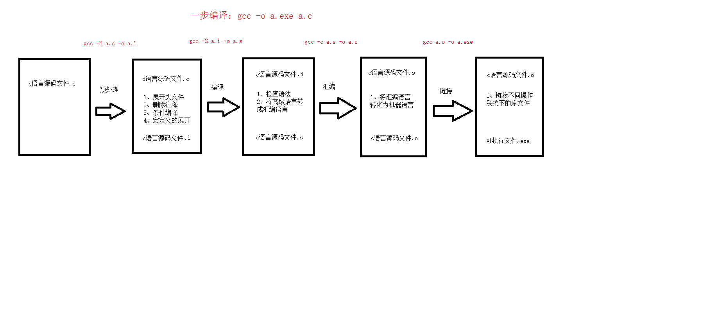
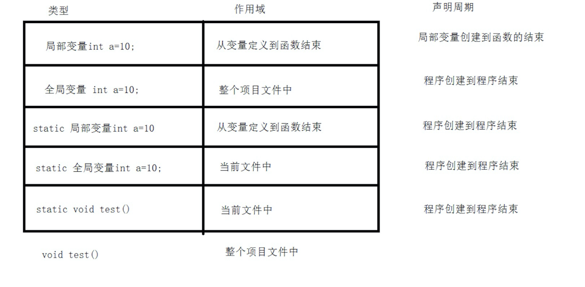

# C++语法

## gcc编译过程


- 预处理
    - 1，宏定义展开
    - 2，头文件展开
    - 3，删除注释
    - 4，条件编译
    - gcc -E a.c -o a.i
- 编译
    - 1，检查语法
    - 2，转换成汇编语言
    - gcc -S a.i -o a.s
- 汇编
    - 1，汇编语言转换成机器语言
    - gcc -c a.s -o a.o
- 链接
    - 1，将库文件链接变成可执行文件
    - gcc a.o -o a.exe





## 指针


### 指针和数组

- 数组名是数组的首地址，所以可以直接赋值给指针
- 对被复制的指针操作，间接操作数组
- 通过```*p = xxx; *(p + 1) = xxx```的方式可以改变数组项的值

```c
int arr[10];
int *p = arr;

*p = 1; // arr[0]
*(p + 1) = 2; // arr[1]
p[3] = 3; // arr[3]


for(int i = 0; i < 10; i++)
{
    cout << p[i] << endl;
}
```

## 变量

一个变量定义之后可以在整个项目多文件中使用，但是需要先声明

```c
extern int a;
```

### 静态变量

- 静态局部变量： 只会被初始化一次，函数多次调用，使用的是同一个局部变量。
- 静态全局变量（函数）： 只能在声明的那个文件中使用。

## 变量的作用域和生命周期




## 内存操作

- malloc： 用来开辟空间
- memset： 重置内存


## 复合数据类型

### 结构体
结构体的定义和使用： 
```c++
struct Ruios{
    char name[21];
    unsigned int age;
    char tel[16];
    char sex;
};

int main(){
//使用结构体： 用顺序
   struct Ruios ruios = {"lirui", 26, "13085274870", 'm'};
//使用结构体，不用顺序
   struct Ruios ruios = {.sex = 'M', .age = 26, .name = "lirui", .tel = "13085274870"};
   return 0;
}


```
### 共用体

共用体的定义和使用：
```c++

union vars {
    int a;
    short b;
    unsigned int c;
    long d;
} var;

int main() {
    var.a = 1;
    var.b = 2;
    var.c = 3;
    var.d = 4;
    cout << var.a<< endl;
    cout << var.b<< endl;
    cout << var.c<< endl;
    cout << var.d<< endl;

    // 结构体的值取决于它的成员的最后一次赋值

    // 4
    // 4   
    // 4
    // 4
}

```


共用体的内存大小： 先找最大的数据类型，再看成员中占的最大的内存是否是最大数据类型的倍数

### 枚举

枚举的定义和使用：

```c++

enum colors {
    red, blue, yellow
};

int main() {
    enum colors color1 = red;
    enum colors colors = blue;
}
```

::: tip
当枚举的某个值被赋值后，后面的值增加1
::: 


## 模板

模板是泛型编程的应用

 


