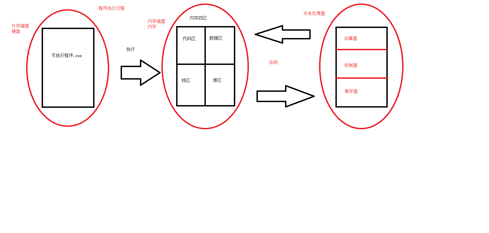

# C++语法

## gcc编译过程


- 预处理
    - 1，宏定义展开
    - 2，头文件展开
    - 3，删除注释
    - 4，条件编译
    - gcc -E a.c -o a.i
- 编译
    - 1，检查语法
    - 2，转换成汇编语言
    - gcc -S a.i -o a.s
- 汇编
    - 1，汇编语言转换成机器语言
    - gcc -c a.s -o a.o
- 链接
    - 1，将库文件链接变成可执行文件
    - gcc a.o -o a.exe





## 指针


### 指针和数组

- 数组名是数组的首地址，所以可以直接赋值给指针
- 对被复制的指针操作，间接操作数组

```c++
int arr[10];
int *p = arr;

for(int i = 0; i < 10; i++)
{
    cout << p[i] << endl;
}
```


 


