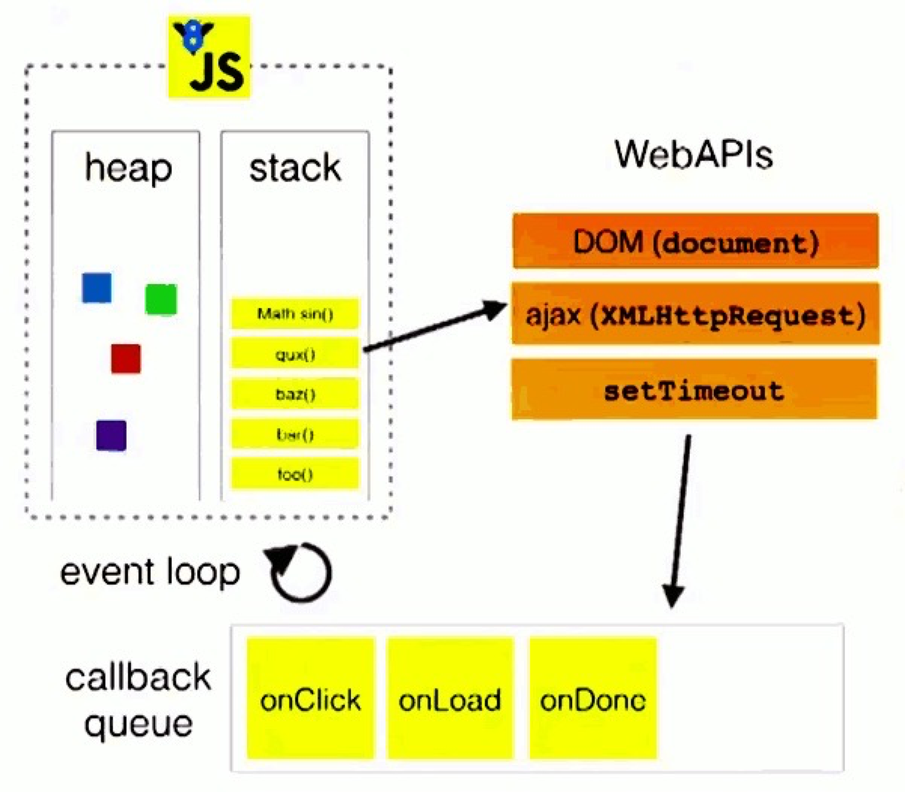

# JavaScript 事件循环

## Macro Task 和 Micro Task

常见的Macro Task： 
- setInterval
- setTimeout
- requestAnimationFrame

常见的Micro Task
- Promise
- MutationObserver

## 原理

在script标签引入代码开始第一个宏任务的执行，在碰到**promise**等创建微任务的事件后，将回调函数推入微任务事件队列。
当script的代码执行完成后，开始清空**微任务队列**里的回调函数。然后再**取出一个宏任务**开始执行。

::: tip
即： 当前宏任务执行完毕后，会清空当前微任务队列，然后执行下一个宏任务。
:::
