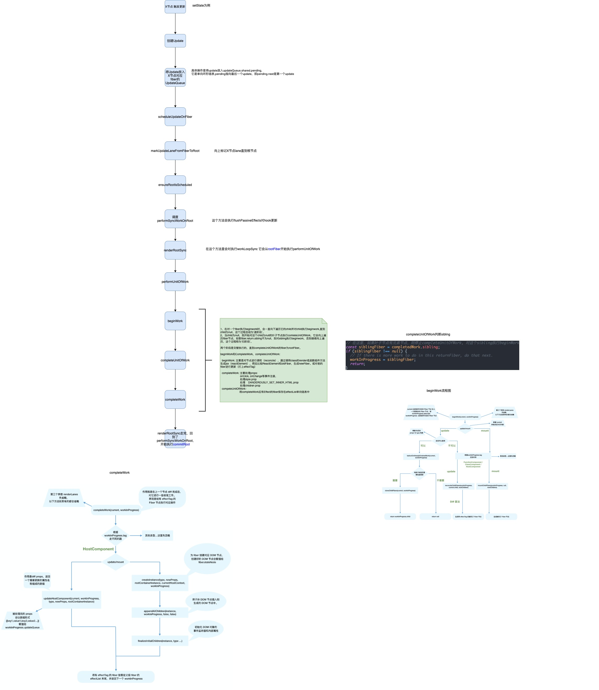

# React 对fiber的更新

## beginWork

::: details 查看代码 
```js
function beginWork(
  current: Fiber | null,
  workInProgress: Fiber,
  renderExpirationTime: ExpirationTime,
): Fiber | null {
  const updateExpirationTime = workInProgress.expirationTime;

  if (current !== null) {
    const oldProps = current.memoizedProps;
    const newProps = workInProgress.pendingProps;
    // 判断 props 和 context 是否改变
    if (oldProps !== newProps || hasLegacyContextChanged()) {
      // If props or context changed, mark the fiber as having performed work.
      // This may be unset if the props are determined to be equal later (memo).
      didReceiveUpdate = true;
    //  判断当前 fiber 的优先级是否小于本次渲染的优先级，小于的话可以跳过
    } else if (updateExpirationTime < renderExpirationTime) {
      didReceiveUpdate = false;
      // This fiber does not have any pending work. Bailout without entering
      // the begin phase. There's still some bookkeeping we that needs to be done
      // in this optimized path, mostly pushing stuff onto the stack.
      // 根据节点进行优化
      switch (workInProgress.tag) {
        case HostRoot:
          pushHostRootContext(workInProgress);
          resetHydrationState();
          break;
        case HostComponent:
          pushHostContext(workInProgress);
          break;
        case ClassComponent: {
          const Component = workInProgress.type;
          if (isLegacyContextProvider(Component)) {
            pushLegacyContextProvider(workInProgress);
          }
          break;
        }
        case HostPortal:
          pushHostContainer(
            workInProgress,
            workInProgress.stateNode.containerInfo,
          );
          break;
        case ContextProvider: {
          const newValue = workInProgress.memoizedProps.value;
          pushProvider(workInProgress, newValue);
          break;
        }
        case Profiler:
          if (enableProfilerTimer) {
            workInProgress.effectTag |= Update;
          }
          break;
        case SuspenseComponent: {
          const state: SuspenseState | null = workInProgress.memoizedState;
          const didTimeout = state !== null;
          if (didTimeout) {
            // If this boundary is currently timed out, we need to decide
            // whether to retry the primary children, or to skip over it and
            // go straight to the fallback. Check the priority of the primary
            // child fragment.
            const primaryChildFragment: Fiber = (workInProgress.child: any);
            const primaryChildExpirationTime =
              primaryChildFragment.childExpirationTime;
            if (
              primaryChildExpirationTime !== NoWork &&
              primaryChildExpirationTime >= renderExpirationTime
            ) {
              // The primary children have pending work. Use the normal path
              // to attempt to render the primary children again.
              return updateSuspenseComponent(
                current,
                workInProgress,
                renderExpirationTime,
              );
            } else {
              // The primary children do not have pending work with sufficient
              // priority. Bailout.
              const child = bailoutOnAlreadyFinishedWork(
                current,
                workInProgress,
                renderExpirationTime,
              );
              if (child !== null) {
                // The fallback children have pending work. Skip over the
                // primary children and work on the fallback.
                return child.sibling;
              } else {
                return null;
              }
            }
          }
          break;
        }
        case DehydratedSuspenseComponent: {
          if (enableSuspenseServerRenderer) {
            // We know that this component will suspend again because if it has
            // been unsuspended it has committed as a regular Suspense component.
            // If it needs to be retried, it should have work scheduled on it.
            workInProgress.effectTag |= DidCapture;
          }
          break;
        }
        case EventComponent:
          if (enableEventAPI) {
            pushHostContextForEventComponent(workInProgress);
          }
          break;
        case EventTarget: {
          if (enableEventAPI) {
            pushHostContextForEventTarget(workInProgress);
          }
          break;
        }
      }
      // 判断该节点下的子节点优先级是否大于 renderExpirationTime
      // 如果也是小于的话，就可以直接把整个子树跳过循环
      return bailoutOnAlreadyFinishedWork(
        current,
        workInProgress,
        renderExpirationTime,
      );
    }
  } else {
    didReceiveUpdate = false;
  }

  // Before entering the begin phase, clear the expiration time.
  workInProgress.expirationTime = NoWork;

  switch (workInProgress.tag) {
    case IndeterminateComponent: {
        // ...
    }
    case LazyComponent: {

    }
    case FunctionComponent: {
      const Component = workInProgress.type;
      const unresolvedProps = workInProgress.pendingProps;
      const resolvedProps =
        workInProgress.elementType === Component
          ? unresolvedProps
          : resolveDefaultProps(Component, unresolvedProps);
      return updateFunctionComponent(
        current,
        workInProgress,
        Component,
        resolvedProps,
        renderExpirationTime,
      );
    }
    case ClassComponent: {
      const Component = workInProgress.type;
      const unresolvedProps = workInProgress.pendingProps;
      const resolvedProps =
        workInProgress.elementType === Component
          ? unresolvedProps
          : resolveDefaultProps(Component, unresolvedProps);
      return updateClassComponent(
        current,
        workInProgress,
        Component,
        resolvedProps,
        renderExpirationTime,
      );
    }
    case HostRoot:
      return updateHostRoot(current, workInProgress, renderExpirationTime);
    case HostComponent:
      return updateHostComponent(current, workInProgress, renderExpirationTime);
    case HostText:
      return updateHostText(current, workInProgress);
    case SuspenseComponent:
      return updateSuspenseComponent(
        current,
        workInProgress,
        renderExpirationTime,
      );
    case HostPortal:
        // ...
    case ForwardRef: {
        // ...
    }
    case Fragment:
      return updateFragment(current, workInProgress, renderExpirationTime);
    case Mode:
      return updateMode(current, workInProgress, renderExpirationTime);
    case Profiler:
      return updateProfiler(current, workInProgress, renderExpirationTime);
    case ContextProvider:
        // ...
    case ContextConsumer:
        // ...
    case MemoComponent: {
        // ...
    }
    case SimpleMemoComponent: {
        // ...
    }
    case IncompleteClassComponent: {
        // ...
    }
    case DehydratedSuspenseComponent: {
        // ...
    }
    case EventComponent: {
        // ...
    }
    case EventTarget: {
        // ...
    }
  }
}
```
:::

该方法主要逻辑在 
```js
  switch (workInProgress.tag) {
      case ...
  }
```
通过fiber上不同的*tag*类型，对不同类型的组件进行更新，这里以*Function Component* 和 *Class Component* 为例：

### Function Component 

对Function Component 进行更新会调用 *updateFunctionComponent*：
::: details 查看代码
```js
function updateFunctionComponent(
  current,
  workInProgress,
  Component,
  nextProps: any,
  renderExpirationTime,
) {

  const unmaskedContext = getUnmaskedContext(workInProgress, Component, true);
  const context = getMaskedContext(workInProgress, unmaskedContext);

  let nextChildren;
  prepareToReadContext(workInProgress, renderExpirationTime);
  if (__DEV__) {
    ReactCurrentOwner.current = workInProgress;
    setCurrentPhase('render');
    nextChildren = renderWithHooks(
      current,
      workInProgress,
      Component,
      nextProps,
      context,
      renderExpirationTime,
    );
    if (
      debugRenderPhaseSideEffects ||
      (debugRenderPhaseSideEffectsForStrictMode &&
        workInProgress.mode & StrictMode)
    ) {
      // Only double-render components with Hooks
      if (workInProgress.memoizedState !== null) {
        nextChildren = renderWithHooks(
          current,
          workInProgress,
          Component,
          nextProps,
          context,
          renderExpirationTime,
        );
      }
    }
    setCurrentPhase(null);
  } else {
    // 返回值就是这个 let children = Component(props, refOrContext)
    // 我们可以发现函数组件第二个参数可以接收 context 对象
    nextChildren = renderWithHooks(
      current,
      workInProgress,
      Component,
      nextProps,
      context,
      renderExpirationTime,
    );
  }

  if (current !== null && !didReceiveUpdate) {
    bailoutHooks(current, workInProgress, renderExpirationTime);
    return bailoutOnAlreadyFinishedWork(
      current,
      workInProgress,
      renderExpirationTime,
    );
  }

  // React DevTools reads this flag.
  workInProgress.effectTag |= PerformedWork;
  reconcileChildren(
    current,
    workInProgress,
    nextChildren,
    renderExpirationTime,
  );
  return workInProgress.child;
}
```
:::

在该方法里先调用*renderWithHooks*，这个方法实质上是
```js
let children = Component(props, refOrContext);
// ... 一系列hooks操作（之后会讲）
```
在通过调用函数组件方法后，获得其*return*的*children*,最后调和子组件（调用 *reconcileChildren*）；

```js
export function reconcileChildren(
  current: Fiber | null,
  workInProgress: Fiber,
  nextChildren: any,
  renderExpirationTime: ExpirationTime,
) {
  if (current === null) {
    // 第一次渲染组件
    workInProgress.child = mountChildFibers(
      workInProgress,
      null,
      nextChildren,
      renderExpirationTime,
    );
  } else {
    // 更新组件
    workInProgress.child = reconcileChildFibers(
      workInProgress,
      current.child,
      nextChildren,
      renderExpirationTime,
    );
  }
```

*reconcileChildren*方法会根据是否是第一次渲染分别调用*mountChildFibers*或*reconcileChildFibers*，而这两个方法实际上都是调用的 *ChildReconciler()方法的返回值*
```js
export const reconcileChildFibers = ChildReconciler(true);
export const mountChildFibers = ChildReconciler(false);
```
*ChildReconciler* 方法返回的是 *reconcileChildFibers*方法：

::: details 查看代码
```js
  function reconcileChildFibers(
    returnFiber: Fiber,
    currentFirstChild: Fiber | null,
    newChild: any,
    expirationTime: ExpirationTime,
  ): Fiber | null {
    // This function is not recursive.
    // If the top level item is an array, we treat it as a set of children,
    // not as a fragment. Nested arrays on the other hand will be treated as
    // fragment nodes. Recursion happens at the normal flow.

    // Handle top level unkeyed fragments as if they were arrays.
    // This leads to an ambiguity between <>{[...]}</> and <>...</>.
    // We treat the ambiguous cases above the same.
    // 判断是否为 fragment，是的话取 fragment 的 children
    const isUnkeyedTopLevelFragment =
      typeof newChild === 'object' &&
      newChild !== null &&
      newChild.type === REACT_FRAGMENT_TYPE &&
      newChild.key === null;
    //  是的话，就取 fragment 的 children
    if (isUnkeyedTopLevelFragment) {
      newChild = newChild.props.children;
    }

    // Handle object types
    // 接下来开始判断返回值的类型
    const isObject = typeof newChild === 'object' && newChild !== null;

    if (isObject) {
      // 判断下类型，反正都是单个节点的类型，
      switch (newChild.$$typeof) {
        case REACT_ELEMENT_TYPE:
          return placeSingleChild(
            reconcileSingleElement(
              returnFiber,
              currentFirstChild,
              newChild,
              expirationTime,
            ),
          );
        case REACT_PORTAL_TYPE:
          return placeSingleChild(
            reconcileSinglePortal(
              returnFiber,
              currentFirstChild,
              newChild,
              expirationTime,
            ),
          );
      }
    }

    if (typeof newChild === 'string' || typeof newChild === 'number') {
      // 判断之前是否也是 text Node，是的话就可以复用，只需要替换文本即可
      return placeSingleChild(
        reconcileSingleTextNode(
          returnFiber,
          currentFirstChild,
          '' + newChild,
          expirationTime,
        ),
      );
    }
    // 处理子节点是数组的情况
    if (isArray(newChild)) {
      return reconcileChildrenArray(
        returnFiber,
        currentFirstChild,
        newChild,
        expirationTime,
      );
    }

    if (getIteratorFn(newChild)) {
      return reconcileChildrenIterator(
        returnFiber,
        currentFirstChild,
        newChild,
        expirationTime,
      );
    }

    if (isObject) {
      throwOnInvalidObjectType(returnFiber, newChild);
    }

    if (__DEV__) {
      if (typeof newChild === 'function') {
        warnOnFunctionType();
      }
    }
    // 错误处理
    if (typeof newChild === 'undefined' && !isUnkeyedTopLevelFragment) {
      // If the new child is undefined, and the return fiber is a composite
      // component, throw an error. If Fiber return types are disabled,
      // we already threw above.
      switch (returnFiber.tag) {
        case ClassComponent: {
  
        }
        // Intentionally fall through to the next case, which handles both
        // functions and classes
        // eslint-disable-next-lined no-fallthrough
        case FunctionComponent: {
          const Component = returnFiber.type;
          invariant(
            false,
            '%s(...): Nothing was returned from render. This usually means a ' +
              'return statement is missing. Or, to render nothing, ' +
              'return null.',
            Component.displayName || Component.name || 'Component',
          );
        }
      }
    }

    // Remaining cases are all treated as empty.
    // 进这里说明返回值为 null，删除所有的 children
    return deleteRemainingChildren(returnFiber, currentFirstChild);
  }
```

:::

可以看到
- 这个方法会根据children的类型（Object , string | number, Array | Iterator）来分别更新，这里 *Object && REACT_ELEMENT_TYPE* 为例，*Array* 涉及到**React Diff**后续会单独讲。
- bailout的逻辑是：
  - props的引用是否发生变化（如果是被memo高阶组件包裹，则会shallowEqual）
  - 优先级需要足够
  - context没有变化
  - dev模式还有type是否变化


在children的类型是```Object```且其```$$typeof === REACT_ELEMENT_TYPE``` 时：

::: details 查看代码
```js
case REACT_ELEMENT_TYPE:
  return placeSingleChild(
    reconcileSingleElement(
      returnFiber,
      currentFirstChild,
      newChild,
      expirationTime,
    ),
  );

  // ...

function reconcileSingleElement(
    returnFiber: Fiber,
    currentFirstChild: Fiber | null,
    element: ReactElement,
    expirationTime: ExpirationTime,
  ): Fiber {
    const key = element.key;
    let child = currentFirstChild;
    // 找到一个 可以 复用的节点
    while (child !== null) {
      // TODO: If key === null and child.key === null, then this only applies to
      // the first item in the list.
      if (child.key === key) {
        if (
          child.tag === Fragment
            ? element.type === REACT_FRAGMENT_TYPE
            : child.elementType === element.type
        ) {
          // key 相同且 type 相同，进行复用，不相同呢就开始删
          // 复用当前节点， 删掉其他的（因为是单节点）
          deleteRemainingChildren(returnFiber, child.sibling);
          const existing = useFiber(
            child,
            element.type === REACT_FRAGMENT_TYPE
              ? element.props.children
              : element.props,
            expirationTime,
          );
          existing.ref = coerceRef(returnFiber, child, element);
          existing.return = returnFiber;
          if (__DEV__) {
            existing._debugSource = element._source;
            existing._debugOwner = element._owner;
          }
          return existing;
        } else {
          deleteRemainingChildren(returnFiber, child);
          break;
        }
      } else {
        deleteChild(returnFiber, child);
      }
      child = child.sibling;
    }

    // 不相同的情况下去创建新的 fiber node， 此时找不到能复用的节点
    if (element.type === REACT_FRAGMENT_TYPE) {
      const created = createFiberFromFragment(
        element.props.children,
        returnFiber.mode,
        expirationTime,
        element.key,
      );
      created.return = returnFiber;
      return created;
    } else {
      const created = createFiberFromElement(
        element,
        returnFiber.mode,
        expirationTime,
      );
      created.ref = coerceRef(returnFiber, currentFirstChild, element);
      created.return = returnFiber;
      return created;
    }
  }


function placeSingleChild(newFiber: Fiber): Fiber {
    // This is simpler for the single child case. We only need to do a
    // placement for inserting new children.
    if (shouldTrackSideEffects && newFiber.alternate === null) {
      newFiber.effectTag = Placement;
    }
    return newFiber;
  }
```

:::

会先调用*reconcileSingleElement*方法， 该方法用首先通过*key*来找到可以复用的fiber，如果可以复用则直接返回，否则会创建新的fiber对象返回。
然后调用*placeSingleChild*方法，参数是上面方法返回的fiber对象，*placeSingleChild*方法很简单，就是为fiber的effectTag属性赋值**Placement**

至此，*beginWork*的一次执行走完，会对上面返回的fiber进行下一次*beginWork*的执行。

### beginWork总结
*beginWork*方法主要来更新调和子节点，通过组件类型不同使用不同方法得到*children*(Functon Component直接调用，Class Component 使用 **new**),然后给fiber打上对应的**EffectTag**(其中包含是否可复用的fiber)。其中，当 新老props相等，且优先级不够的时候，会直接调用*bailoutOnAlreadyFinishedWork* 返回*null*， 从而跳出*beginWork*不继续向下遍历。

### beginWork流程图
*仅供参考，来自网络， 这个流程图没有说明在fiber不可以复用时需要打上Deletion的tag*


## completeUnitOfWork

在*beginWork*到叶子节点（即fiber.child === null）时，会执行*completeUnitOfWork*
该方法的参数与进入*beginWork*时的参数是同一个，都是一个fiber，该方法大体是这样：

::: details 查看代码
```js
  do {
    // The current, flushed, state of this fiber is the alternate. Ideally
    // nothing should rely on this, but relying on it here means that we don't
    // need an additional field on the work in progress.
    const current = workInProgress.alternate;
    const returnFiber = workInProgress.return;

    // Check if the work completed or if something threw.
      next = completeWork(current, workInProgress, renderExpirationTime);


      if (next !== null) {
        // Completing this fiber spawned new work. Work on that next.
        return next;
      }

      if (
        returnFiber !== null &&
        // Do not append effects to parents if a sibling failed to complete
        (returnFiber.effectTag & Incomplete) === NoEffect
      ) {
        // Append all the effects of the subtree and this fiber onto the effect
        // list of the parent. The completion order of the children affects the
        // side-effect order.
        if (returnFiber.firstEffect === null) {
          returnFiber.firstEffect = workInProgress.firstEffect;
        }
        if (workInProgress.lastEffect !== null) {
          if (returnFiber.lastEffect !== null) {
            returnFiber.lastEffect.nextEffect = workInProgress.firstEffect;
          }
          returnFiber.lastEffect = workInProgress.lastEffect;
        }
        const effectTag = workInProgress.effectTag;

        if (effectTag > PerformedWork) {
          if (returnFiber.lastEffect !== null) {
            returnFiber.lastEffect.nextEffect = workInProgress;
          } else {
            returnFiber.firstEffect = workInProgress;
          }
          returnFiber.lastEffect = workInProgress;
        }
   

      const siblingFiber = workInProgress.sibling;
      if (siblingFiber !== null) {
        // If there is more work to do in this returnFiber, do that next.
        return siblingFiber;
      }
      // Otherwise, return to the parent
      workInProgress = returnFiber;
    } while (workInProgress !== null);
```
:::
该方法会遍历执行：
  * 1，执行 *completeWork*；
  * 2，收集 *Effect* 链；

### 执行completeWork
*completeWork*方法最主要是对*HostComponent*进行处理

* 如果是update：
```js
if (current !== null && workInProgress.stateNode != null) {
  // update的情况
  updateHostComponent(
    current,
    workInProgress,
    type,
    newProps,
    rootContainerInstance,
  );
}
```
*updateHostComponent*会判断新老props是否相同，如果相同则直接return，否则，调用*prepareUpdate*得到**updatePayload**（其中updatePayload为数组形式，他的奇数索引的值为变化的prop key，偶数索引的值为变化的prop value）, *prepareUpdate* 实际上调用的是 *diffProperties*：

::: details diffProperties方法
```js
export function diffProperties(
  domElement: Element,
  tag: string,
  lastRawProps: Object,
  nextRawProps: Object,
  rootContainerElement: Element | Document,
): null | Array<mixed> {
  if (__DEV__) {
    validatePropertiesInDevelopment(tag, nextRawProps);
  }

  let updatePayload: null | Array<any> = null;

  let lastProps: Object;
  let nextProps: Object;
  switch (tag) {
    case 'input':
      lastProps = ReactDOMInputGetHostProps(domElement, lastRawProps);
      nextProps = ReactDOMInputGetHostProps(domElement, nextRawProps);
      updatePayload = [];
      break;
    case 'option':
      lastProps = ReactDOMOptionGetHostProps(domElement, lastRawProps);
      nextProps = ReactDOMOptionGetHostProps(domElement, nextRawProps);
      updatePayload = [];
      break;
    case 'select':
      lastProps = ReactDOMSelectGetHostProps(domElement, lastRawProps);
      nextProps = ReactDOMSelectGetHostProps(domElement, nextRawProps);
      updatePayload = [];
      break;
    case 'textarea':
      lastProps = ReactDOMTextareaGetHostProps(domElement, lastRawProps);
      nextProps = ReactDOMTextareaGetHostProps(domElement, nextRawProps);
      updatePayload = [];
      break;
    default:
      lastProps = lastRawProps;
      nextProps = nextRawProps;
      if (
        typeof lastProps.onClick !== 'function' &&
        typeof nextProps.onClick === 'function'
      ) {
        // TODO: This cast may not be sound for SVG, MathML or custom elements.
        trapClickOnNonInteractiveElement(((domElement: any): HTMLElement));
      }
      break;
  }

  assertValidProps(tag, nextProps);

  let propKey;
  let styleName;
  let styleUpdates = null;
  for (propKey in lastProps) {
    if (
      nextProps.hasOwnProperty(propKey) ||
      !lastProps.hasOwnProperty(propKey) ||
      lastProps[propKey] == null
    ) {
      continue;
    }
    if (propKey === STYLE) {
      const lastStyle = lastProps[propKey];
      for (styleName in lastStyle) {
        if (lastStyle.hasOwnProperty(styleName)) {
          if (!styleUpdates) {
            styleUpdates = {};
          }
          styleUpdates[styleName] = '';
        }
      }
    } else if (propKey === DANGEROUSLY_SET_INNER_HTML || propKey === CHILDREN) {
      // Noop. This is handled by the clear text mechanism.
    } else if (
      (enableDeprecatedFlareAPI && propKey === DEPRECATED_flareListeners) ||
      propKey === SUPPRESS_CONTENT_EDITABLE_WARNING ||
      propKey === SUPPRESS_HYDRATION_WARNING
    ) {
      // Noop
    } else if (propKey === AUTOFOCUS) {
      // Noop. It doesn't work on updates anyway.
    } else if (registrationNameDependencies.hasOwnProperty(propKey)) {
      // This is a special case. If any listener updates we need to ensure
      // that the "current" fiber pointer gets updated so we need a commit
      // to update this element.
      if (!updatePayload) {
        updatePayload = [];
      }
    } else {
      // For all other deleted properties we add it to the queue. We use
      // the allowed property list in the commit phase instead.
      (updatePayload = updatePayload || []).push(propKey, null);
    }
  }
  for (propKey in nextProps) {
    const nextProp = nextProps[propKey];
    const lastProp = lastProps != null ? lastProps[propKey] : undefined;
    if (
      !nextProps.hasOwnProperty(propKey) ||
      nextProp === lastProp ||
      (nextProp == null && lastProp == null)
    ) {
      continue;
    }
    if (propKey === STYLE) {
      if (__DEV__) {
        if (nextProp) {
          // Freeze the next style object so that we can assume it won't be
          // mutated. We have already warned for this in the past.
          Object.freeze(nextProp);
        }
      }
      if (lastProp) {
        // Unset styles on `lastProp` but not on `nextProp`.
        for (styleName in lastProp) {
          if (
            lastProp.hasOwnProperty(styleName) &&
            (!nextProp || !nextProp.hasOwnProperty(styleName))
          ) {
            if (!styleUpdates) {
              styleUpdates = {};
            }
            styleUpdates[styleName] = '';
          }
        }
        // Update styles that changed since `lastProp`.
        for (styleName in nextProp) {
          if (
            nextProp.hasOwnProperty(styleName) &&
            lastProp[styleName] !== nextProp[styleName]
          ) {
            if (!styleUpdates) {
              styleUpdates = {};
            }
            styleUpdates[styleName] = nextProp[styleName];
          }
        }
      } else {
        // Relies on `updateStylesByID` not mutating `styleUpdates`.
        if (!styleUpdates) {
          if (!updatePayload) {
            updatePayload = [];
          }
          updatePayload.push(propKey, styleUpdates);
        }
        styleUpdates = nextProp;
      }
    } else if (propKey === DANGEROUSLY_SET_INNER_HTML) {
      const nextHtml = nextProp ? nextProp[HTML] : undefined;
      const lastHtml = lastProp ? lastProp[HTML] : undefined;
      if (nextHtml != null) {
        if (lastHtml !== nextHtml) {
          (updatePayload = updatePayload || []).push(propKey, nextHtml);
        }
      } else {
        // TODO: It might be too late to clear this if we have children
        // inserted already.
      }
    } else if (propKey === CHILDREN) {
      if (typeof nextProp === 'string' || typeof nextProp === 'number') {
        (updatePayload = updatePayload || []).push(propKey, '' + nextProp);
      }
    } else if (
      (enableDeprecatedFlareAPI && propKey === DEPRECATED_flareListeners) ||
      propKey === SUPPRESS_CONTENT_EDITABLE_WARNING ||
      propKey === SUPPRESS_HYDRATION_WARNING
    ) {
      // Noop
    } else if (registrationNameDependencies.hasOwnProperty(propKey)) {
      if (nextProp != null) {
        // We eagerly listen to this even though we haven't committed yet.
        if (__DEV__ && typeof nextProp !== 'function') {
          warnForInvalidEventListener(propKey, nextProp);
        }
        ensureListeningTo(rootContainerElement, propKey);
      }
      if (!updatePayload && lastProp !== nextProp) {
        // This is a special case. If any listener updates we need to ensure
        // that the "current" props pointer gets updated so we need a commit
        // to update this element.
        updatePayload = [];
      }
    } else if (
      typeof nextProp === 'object' &&
      nextProp !== null &&
      nextProp.$$typeof === REACT_OPAQUE_ID_TYPE
    ) {
      // If we encounter useOpaqueReference's opaque object, this means we are hydrating.
      // In this case, call the opaque object's toString function which generates a new client
      // ID so client and server IDs match and throws to rerender.
      nextProp.toString();
    } else {
      // For any other property we always add it to the queue and then we
      // filter it out using the allowed property list during the commit.
      (updatePayload = updatePayload || []).push(propKey, nextProp);
    }
  }
  if (styleUpdates) {
    if (__DEV__) {
      validateShorthandPropertyCollisionInDev(styleUpdates, nextProps[STYLE]);
    }
    (updatePayload = updatePayload || []).push(STYLE, styleUpdates);
  }
  return updatePayload;
}
```
:::
这个方法很长，主要作用是找到变化的属性，包括样式属性。

在得到updatePayload后，将其放在对应fiber的*updateQueue*上：
```js
workInProgress.updateQueue = (updatePayload: any);
```

* 如果是mount：
```js
// ...
const instance = createInstance(
  type,
  newProps,
  rootContainerInstance,
  currentHostContext,
  workInProgress,
);
appendAllChildren(instance, workInProgress, false, false);
// This needs to be set before we mount Flare event listeners
workInProgress.stateNode = instance;
// ...
```

会先创建*DOM*实例，然后调用*appendAllChildren*，**将该fiber下的所有HostCompoent组件对应的Dom实例全部挂载在新创建的DOM上**,这样的好处是，到rootfiber时，已经有一颗离屏DOM树被创建。
而mount时只会在rootFiber存在Placement effectTag，这样，真正页面上的dom操作只会有一次。

::: details appAllChildren方法
```js
  appendAllChildren = function(
    parent: Instance,
    workInProgress: Fiber,
    needsVisibilityToggle: boolean,
    isHidden: boolean,
  ) {
    // We only have the top Fiber that was created but we need recurse down its
    // children to find all the terminal nodes.
    let node = workInProgress.child;
    while (node !== null) {
      if (node.tag === HostComponent || node.tag === HostText) {
        appendInitialChild(parent, node.stateNode);
      } else if (enableFundamentalAPI && node.tag === FundamentalComponent) {
        appendInitialChild(parent, node.stateNode.instance);
      } else if (node.tag === HostPortal) {
        // If we have a portal child, then we don't want to traverse
        // down its children. Instead, we'll get insertions from each child in
        // the portal directly.
      } else if (node.child !== null) {
        node.child.return = node;
        node = node.child;
        continue;
      }
      if (node === workInProgress) {
        return;
      }
      while (node.sibling === null) {
        if (node.return === null || node.return === workInProgress) {
          return;
        }
        node = node.return;
      }
      node.sibling.return = node.return;
      node = node.sibling;
    }
  };
```
:::

### 拼接Effect链

*completeUnitOfWork*还有一个作用就是拼接Effect链：
::: details 查看代码
```js
  if (
    returnFiber !== null &&
    (returnFiber.effectTag & Incomplete) === NoEffect
  ) {

    if (returnFiber.firstEffect === null) {
      returnFiber.firstEffect = completedWork.firstEffect;
    }
    if (completedWork.lastEffect !== null) {
      if (returnFiber.lastEffect !== null) {
        returnFiber.lastEffect.nextEffect = completedWork.firstEffect;
      }
      returnFiber.lastEffect = completedWork.lastEffect;
    }

    const effectTag = completedWork.effectTag;

    if (effectTag > PerformedWork) {
      if (returnFiber.lastEffect !== null) {
        returnFiber.lastEffect.nextEffect = completedWork;
      } else {
        returnFiber.firstEffect = completedWork;
      }
      returnFiber.lastEffect = completedWork;
    }
  }
}
```
:::

所有*有effectTag的Fiber节点*都会被追加在effectList中，最终形成一条以rootFiber.firstEffect为起点的单向链表。
```js
                       nextEffect         nextEffect
rootFiber.firstEffect -----------> fiber -----------> fiber
```
这样，在commit阶段只需要遍历effectList就能执行所有effect了。

### completeUnitOfWork总结
*completeUnitOfWork总结*: completeUnitOfWork主要就是'归阶段'，会递归执行 *completeWork* 并*拼接Effect链*。
* completeWork 
会对HostComponent进行处理，如果是mount,则会创建Dom,并且将子孙fiber的**Dom**挂载到创建的Dom上，如果是update，则会比较新老props，将比较的结果放在*fiber.updateQueue*上；
* 拼接Effect链
会把有effectTag的Fiber节点追加到effectList中。


### completeUnitOfWork 流程图
*仅供参考，来自网络*


至此，render阶段全部工作完成。在performSyncWorkOnRoot函数中rootFiber被传递给commitRoot方法，开启commit阶段工作流程。

*自己整理的*




