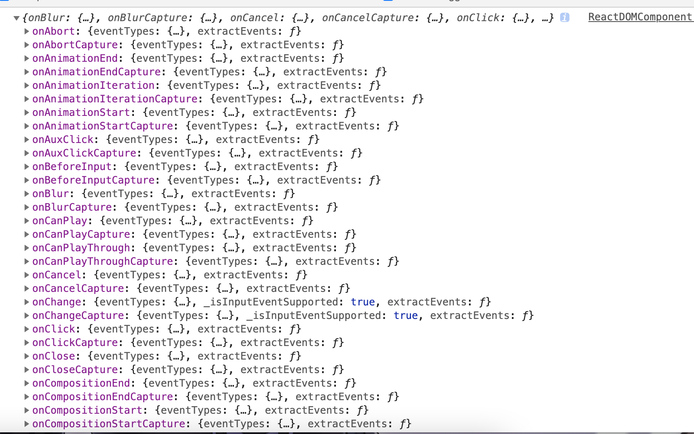
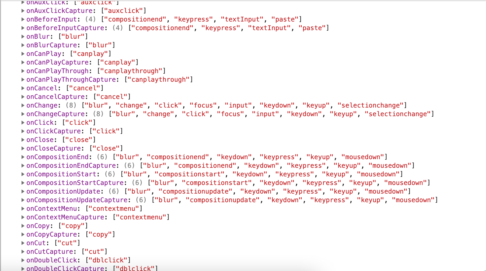

# React 合成事件系统


合成事件系统的好处：

- 减少内存消耗，提升性能，不需要注册那么多的事件了，一种事件类型只在 document 上注册一次
- 统一规范，解决 ie 事件兼容问题，简化事件逻辑
- 对开发者友好

合成事件主要做了：

- 对原生事件的封装
- 对某些事件的升级和改造
- 不同浏览器事件兼容的处理

下面将会从**事件注册**和**事件派发**两个阶段进行说明。

## 事件注册


在```CompleteWork```时，```case HostComponent``` 会依次调用```finalizeInitialChildren -> setInitialProperties```

::: details 查看setInitialProperties代码 

```js
export function setInitialProperties(
  domElement: Element,
  tag: string,
  rawProps: Object,
  rootContainerElement: Element | Document,
): void {
  const isCustomComponentTag = isCustomComponent(tag, rawProps);
  if (__DEV__) {
    validatePropertiesInDevelopment(tag, rawProps);
  }

  // TODO: Make sure that we check isMounted before firing any of these events.
  let props: Object;
  switch (tag) {
    case 'iframe':
    case 'object':
    case 'embed':
      if (!enableModernEventSystem) {
        legacyTrapBubbledEvent(TOP_LOAD, domElement);
      }
      props = rawProps;
      break;
    case 'video':
    case 'audio':
      if (!enableModernEventSystem) {
        // Create listener for each media event
        for (let i = 0; i < mediaEventTypes.length; i++) {
          legacyTrapBubbledEvent(mediaEventTypes[i], domElement);
        }
      }
      props = rawProps;
      break;
    case 'source':
      if (!enableModernEventSystem) {
        legacyTrapBubbledEvent(TOP_ERROR, domElement);
      }
      props = rawProps;
      break;
    case 'img':
    case 'image':
    case 'link':
      if (!enableModernEventSystem) {
        legacyTrapBubbledEvent(TOP_ERROR, domElement);
        legacyTrapBubbledEvent(TOP_LOAD, domElement);
      }
      props = rawProps;
      break;
    case 'form':
      if (!enableModernEventSystem) {
        legacyTrapBubbledEvent(TOP_RESET, domElement);
        legacyTrapBubbledEvent(TOP_SUBMIT, domElement);
      }
      props = rawProps;
      break;
    case 'details':
      if (!enableModernEventSystem) {
        legacyTrapBubbledEvent(TOP_TOGGLE, domElement);
      }
      props = rawProps;
      break;
    case 'input':
      ReactDOMInputInitWrapperState(domElement, rawProps);
      props = ReactDOMInputGetHostProps(domElement, rawProps);
      if (!enableModernEventSystem) {
        legacyTrapBubbledEvent(TOP_INVALID, domElement);
      }
      // For controlled components we always need to ensure we're listening
      // to onChange. Even if there is no listener.
      ensureListeningTo(rootContainerElement, 'onChange');
      break;
    case 'option':
      ReactDOMOptionValidateProps(domElement, rawProps);
      props = ReactDOMOptionGetHostProps(domElement, rawProps);
      break;
    case 'select':
      ReactDOMSelectInitWrapperState(domElement, rawProps);
      props = ReactDOMSelectGetHostProps(domElement, rawProps);
      if (!enableModernEventSystem) {
        legacyTrapBubbledEvent(TOP_INVALID, domElement);
      }
      // For controlled components we always need to ensure we're listening
      // to onChange. Even if there is no listener.
      ensureListeningTo(rootContainerElement, 'onChange');
      break;
    case 'textarea':
      ReactDOMTextareaInitWrapperState(domElement, rawProps);
      props = ReactDOMTextareaGetHostProps(domElement, rawProps);
      if (!enableModernEventSystem) {
        legacyTrapBubbledEvent(TOP_INVALID, domElement);
      }
      // For controlled components we always need to ensure we're listening
      // to onChange. Even if there is no listener.
      ensureListeningTo(rootContainerElement, 'onChange');
      break;
    default:
      props = rawProps;
  }

  assertValidProps(tag, props);

  setInitialDOMProperties(
    tag,
    domElement,
    rootContainerElement,
    props,
    isCustomComponentTag,
  );

  switch (tag) {
    case 'input':
      // TODO: Make sure we check if this is still unmounted or do any clean
      // up necessary since we never stop tracking anymore.
      track((domElement: any));
      ReactDOMInputPostMountWrapper(domElement, rawProps, false);
      break;
    case 'textarea':
      // TODO: Make sure we check if this is still unmounted or do any clean
      // up necessary since we never stop tracking anymore.
      track((domElement: any));
      ReactDOMTextareaPostMountWrapper(domElement, rawProps);
      break;
    case 'option':
      ReactDOMOptionPostMountWrapper(domElement, rawProps);
      break;
    case 'select':
      ReactDOMSelectPostMountWrapper(domElement, rawProps);
      break;
    default:
      if (typeof props.onClick === 'function') {
        // TODO: This cast may not be sound for SVG, MathML or custom elements.
        trapClickOnNonInteractiveElement(((domElement: any): HTMLElement));
      }
      break;
  }
}

```

:::

这个方法会对表单元素进行一些处理，其中比较重要是调用```setInitialDOMProperties```方法：


```js
function setInitialDOMProperties(
  tag: string,
  domElement: Element,
  rootContainerElement: Element | Document,
  nextProps: Object,
  isCustomComponentTag: boolean,
): void {
  for (const propKey in nextProps) {
    if (!nextProps.hasOwnProperty(propKey)) {
      continue;
    }
    const nextProp = nextProps[propKey];
    ... 


     if (registrationNameModules.hasOwnProperty(propKey)) {
      if (nextProp != null) {
        ensureListeningTo(rootContainerElement, propKey);
      }
    }

  ... 
}
```
在这个方法中会通过```registrationNameModules```判断props中是否是注册事件的Prop,其中registrationNameModules如下图：




当判断属性是事件时会调用```ensureListeningTo -> legacyListenToEvent```, 在```legacyListenToEvent```中会获取事件对应的依赖事件,然后对每一个依赖的事件调用```legacyListenToTopLevelEvent```进行注册。




```js
export function legacyListenToEvent(
  registrationName: string,
  mountAt: Document | Element,
): void {
  const listenerMap = getEventListenerMap(mountAt);
  const dependencies = registrationNameDependencies[registrationName];

  for (let i = 0; i < dependencies.length; i++) {
    const dependency = dependencies[i];
    legacyListenToTopLevelEvent(dependency, mountAt, listenerMap);
  }
}
```

在```legacyListenToTopLevelEvent``` 中会判断要注册的事件类型**是否已经注册**, 其中**listenerMap**是存在**mountAt**（这里是document）上的一个属性。如果没有注册，则会调用```legacyTrapBubbledEvent -> addTrappedEventListener```进行事件注册。并将注册事件放在**listenerMap**中。
```js
export function legacyListenToTopLevelEvent(
  topLevelType: DOMTopLevelEventType,
  mountAt: Document | Element,
  listenerMap: ElementListenerMap,
): void {
  if (!listenerMap.has(topLevelType)) {
    switch (topLevelType) {
      case TOP_SCROLL: {
        legacyTrapCapturedEvent(TOP_SCROLL, mountAt, listenerMap);
        break;
      }
      case TOP_FOCUS:
        ...
      default: {
        // By default, listen on the top level to all non-media events.
        // Media events don't bubble so adding the listener wouldn't do anything.
        const isMediaEvent = mediaEventTypes.indexOf(topLevelType) !== -1;
        if (!isMediaEvent) {
          legacyTrapBubbledEvent(topLevelType, mountAt, listenerMap);
        }
        break;
      }
    }
  }
}

export function legacyTrapBubbledEvent(
  topLevelType: DOMTopLevelEventType,
  element: Document | Element,
  listenerMap?: ElementListenerMap,
): void {
  const listener = addTrappedEventListener(
    element,
    topLevelType,
    PLUGIN_EVENT_SYSTEM,
    false,
  );
  if (listenerMap) {
    listenerMap.set(topLevelType, {passive: undefined, listener});
  }
}
```

真实的注册事件事件上通过```addTrappedEventListener -> createEventListenerWrapperWithPriority```注册：
注册的事件带有优先级。
```js
export function createEventListenerWrapperWithPriority(
  targetContainer: EventTarget,
  topLevelType: DOMTopLevelEventType,
  eventSystemFlags: EventSystemFlags,
  priority?: EventPriority,
): Function {
  const eventPriority =
    priority === undefined
      ? getEventPriorityForPluginSystem(topLevelType)
      : priority;
  let listenerWrapper;
  switch (eventPriority) {
    case DiscreteEvent:
      listenerWrapper = dispatchDiscreteEvent;
      break;
    case UserBlockingEvent:
      listenerWrapper = dispatchUserBlockingUpdate;
      break;
    case ContinuousEvent:
    default:
      listenerWrapper = dispatchEvent;
      break;
  }
  return listenerWrapper.bind(
    null,
    topLevelType,
    eventSystemFlags,
    targetContainer,
  );
}
```

以**onClick**事件为例： listener如下
```js
function dispatchDiscreteEvent(
  topLevelType,
  eventSystemFlags,
  container,
  nativeEvent,
) {
  if (
    !enableLegacyFBSupport ||
    // If we have Legacy FB support, it means we've already
    // flushed for this event and we don't need to do it again.
    (eventSystemFlags & LEGACY_FB_SUPPORT) === 0
  ) {
    flushDiscreteUpdatesIfNeeded(nativeEvent.timeStamp);
  }
  discreteUpdates(
    dispatchEvent,
    topLevelType,
    eventSystemFlags,
    container,
    nativeEvent,
  );
}
```
该方法实际上执行的是**dispatchEvent**；

## 事件派发

当事件被触发时，会执行```dispatchEvent```方法：


::: details 查看dispatchEvent方法
```js
export function dispatchEvent(
  topLevelType: DOMTopLevelEventType,
  eventSystemFlags: EventSystemFlags,
  targetContainer: EventTarget,
  nativeEvent: AnyNativeEvent,
): void {
  if (!_enabled) {
    return;
  }
  if (hasQueuedDiscreteEvents() && isReplayableDiscreteEvent(topLevelType)) {
    // If we already have a queue of discrete events, and this is another discrete
    // event, then we can't dispatch it regardless of its target, since they
    // need to dispatch in order.
    queueDiscreteEvent(
      null, // Flags that we're not actually blocked on anything as far as we know.
      topLevelType,
      eventSystemFlags,
      targetContainer,
      nativeEvent,
    );
    return;
  }

  const blockedOn = attemptToDispatchEvent(
    topLevelType,
    eventSystemFlags,
    targetContainer,
    nativeEvent,
  );

  if (blockedOn === null) {
    // We successfully dispatched this event.
    clearIfContinuousEvent(topLevelType, nativeEvent);
    return;
  }

  if (isReplayableDiscreteEvent(topLevelType)) {
    // This this to be replayed later once the target is available.
    queueDiscreteEvent(
      blockedOn,
      topLevelType,
      eventSystemFlags,
      targetContainer,
      nativeEvent,
    );
    return;
  }

  if (
    queueIfContinuousEvent(
      blockedOn,
      topLevelType,
      eventSystemFlags,
      targetContainer,
      nativeEvent,
    )
  ) {
    return;
  }

  // We need to clear only if we didn't queue because
  // queueing is accummulative.
  clearIfContinuousEvent(topLevelType, nativeEvent);

  // This is not replayable so we'll invoke it but without a target,
  // in case the event system needs to trace it.
  if (enableDeprecatedFlareAPI) {
    if (eventSystemFlags & PLUGIN_EVENT_SYSTEM) {
      if (enableModernEventSystem) {
        dispatchEventForPluginEventSystem(
          topLevelType,
          eventSystemFlags,
          nativeEvent,
          null,
          targetContainer,
        );
      } else {
        dispatchEventForLegacyPluginEventSystem(
          topLevelType,
          eventSystemFlags,
          nativeEvent,
          null,
        );
      }
    }
    if (eventSystemFlags & RESPONDER_EVENT_SYSTEM) {
      // React Flare event system
      DEPRECATED_dispatchEventForResponderEventSystem(
        (topLevelType: any),
        null,
        nativeEvent,
        getEventTarget(nativeEvent),
        eventSystemFlags,
      );
    }
  } else {
    if (enableModernEventSystem) {
      dispatchEventForPluginEventSystem(
        topLevelType,
        eventSystemFlags,
        nativeEvent,
        null,
        targetContainer,
      );
    } else {
      dispatchEventForLegacyPluginEventSystem(
        topLevelType,
        eventSystemFlags,
        nativeEvent,
        null,
      );
    }
  }
}

```
:::

该方法会执行```attemptToDispatchEvent -> dispatchEventForLegacyPluginEventSystem```方法

```js
export function dispatchEventForLegacyPluginEventSystem(
  topLevelType: DOMTopLevelEventType,
  eventSystemFlags: EventSystemFlags,
  nativeEvent: AnyNativeEvent,
  targetInst: null | Fiber,
): void {
  const bookKeeping = getTopLevelCallbackBookKeeping(
    topLevelType,
    nativeEvent,
    targetInst,
    eventSystemFlags,
  );

  try {
    // Event queue being processed in the same cycle allows
    // `preventDefault`.
    batchedEventUpdates(handleTopLevel, bookKeeping);
  } finally {
    releaseTopLevelCallbackBookKeeping(bookKeeping);
  }
}

```
这个方法会```callbackBookkeepingPool```池中取出一个**bookKeeping**，最后调用```handleTopLevel```，它会继续调用
```runExtractedPluginEventsInBatch```。

```js
function runExtractedPluginEventsInBatch(
  topLevelType: TopLevelType,
  targetInst: null | Fiber,
  nativeEvent: AnyNativeEvent,
  nativeEventTarget: null | EventTarget,
  eventSystemFlags: EventSystemFlags,
) {
  const events = extractPluginEvents(
    topLevelType,
    targetInst,
    nativeEvent,
    nativeEventTarget,
    eventSystemFlags,
  );
  runEventsInBatch(events);
}
```

调用```extractPluginEvents```获取events对象。
```js
function extractPluginEvents(
  topLevelType: TopLevelType,
  targetInst: null | Fiber,
  nativeEvent: AnyNativeEvent,
  nativeEventTarget: null | EventTarget,
  eventSystemFlags: EventSystemFlags,
): Array<ReactSyntheticEvent> | ReactSyntheticEvent | null {
  let events = null;
  const legacyPlugins = ((plugins: any): Array<LegacyPluginModule<Event>>);
  for (let i = 0; i < legacyPlugins.length; i++) {
    // Not every plugin in the ordering may be loaded at runtime.
    const possiblePlugin = legacyPlugins[i];
    if (possiblePlugin) {
      const extractedEvents = possiblePlugin.extractEvents(
        topLevelType,
        targetInst,
        nativeEvent,
        nativeEventTarget,
        eventSystemFlags,
      );
      if (extractedEvents) {
        events = accumulateInto(events, extractedEvents);
      }
    }
  }
  return events;
}

```

咋extractPluginEvents中会调用react-dom/events/plugins下的各个插件，这些插件主要是生成**合成事件**。以```SimpleEventPlugin```, 在合成事件池里取出一个合成事件后执行```accumulateTwoPhaseDispatches ->  accumulateTwoPhaseDispatchesSingle```。

```js
function accumulateTwoPhaseDispatchesSingle(event) {
  if (event && event.dispatchConfig.phasedRegistrationNames) {
    traverseTwoPhase(event._targetInst, accumulateDirectionalDispatches, event);
  }
}

function traverseTwoPhase(
  inst: Object,
  fn: Function,
  arg: ReactSyntheticEvent,
) {
  const path = [];
  while (inst) {
    path.push(inst);
    inst = getParent(inst);
  }
  let i;
  for (i = path.length; i-- > 0; ) {
    fn(path[i], 'captured', arg);
  }
  for (i = 0; i < path.length; i++) {
    fn(path[i], 'bubbled', arg);
  }
}
```

可以看到，对```accumulateDirectionalDispatches```分别在冒泡和捕获阶段执行```accumulateDirectionalDispatches```,

```js
function accumulateDirectionalDispatches(inst, phase, event) {
  if (__DEV__) {
    if (!inst) {
      console.error('Dispatching inst must not be null');
    }
  }
  const listener = listenerAtPhase(inst, event, phase);
  if (listener) {
    event._dispatchListeners = accumulateInto(
      event._dispatchListeners,
      listener,
    );
    event._dispatchInstances = accumulateInto(event._dispatchInstances, inst);
  }
}

```

accumulateDirectionalDispatches即为event的**_dispatchListeners**和**_dispatchInstances**属性分别添加对应的**事件函数**以及**事件函数对应的target**。

接着在回到```runExtractedPluginEventsInBatch```方法，继续执行```runEventsInBatch -> forEachAccumulated -> executeDispatchesAndReleaseTopLevel```;

```js
export function runEventsInBatch(
  events: Array<ReactSyntheticEvent> | ReactSyntheticEvent | null,
) {
  if (events !== null) {
    eventQueue = accumulateInto(eventQueue, events);
  }

  // Set `eventQueue` to null before processing it so that we can tell if more
  // events get enqueued while processing.
  const processingEventQueue = eventQueue;
  eventQueue = null;

  if (!processingEventQueue) {
    return;
  }

  forEachAccumulated(processingEventQueue, executeDispatchesAndReleaseTopLevel);
  invariant(
    !eventQueue,
    'processEventQueue(): Additional events were enqueued while processing ' +
      'an event queue. Support for this has not yet been implemented.',
  );
  // This would be a good time to rethrow if any of the event handlers threw.
  rethrowCaughtError();
}

```


executeDispatchesAndReleaseTopLevel实际上执行的是executeDispatchesAndRelease方法：

```js
const executeDispatchesAndRelease = function(event: ReactSyntheticEvent) {
  if (event) {
    executeDispatchesInOrder(event);

    if (!event.isPersistent()) {
      event.constructor.release(event);
    }
  }
};


export function executeDispatchesInOrder(event) {
  const dispatchListeners = event._dispatchListeners;
  const dispatchInstances = event._dispatchInstances;
  if (__DEV__) {
    validateEventDispatches(event);
  }
  if (Array.isArray(dispatchListeners)) {
    for (let i = 0; i < dispatchListeners.length; i++) {
      if (event.isPropagationStopped()) {
        break;
      }
      // Listeners and Instances are two parallel arrays that are always in sync.
      executeDispatch(event, dispatchListeners[i], dispatchInstances[i]);
    }
  } else if (dispatchListeners) {
    executeDispatch(event, dispatchListeners, dispatchInstances);
  }
  event._dispatchListeners = null;
  event._dispatchInstances = null;
}
```

在执行```executeDispatchesInOrder```时，会对event._dispatchListeners进行遍历（即每一个我们自己写的事件处理函数），分别执行```executeDispatch```:

```js
export function executeDispatch(event, listener, inst) {
  const type = event.type || 'unknown-event';
  event.currentTarget = getNodeFromInstance(inst);
  invokeGuardedCallbackAndCatchFirstError(type, listener, undefined, event);
  event.currentTarget = null;
}


export function invokeGuardedCallbackAndCatchFirstError<
  A,
  B,
  C,
  D,
  E,
  F,
  Context,
>(
  name: string | null,
  func: (a: A, b: B, c: C, d: D, e: E, f: F) => void,
  context: Context,
  a: A,
  b: B,
  c: C,
  d: D,
  e: E,
  f: F,
): void {
  invokeGuardedCallback.apply(this, arguments);
  if (hasError) {
    const error = clearCaughtError();
    if (!hasRethrowError) {
      hasRethrowError = true;
      rethrowError = error;
    }
  }
}
```
到这里，```executeDispatch```会调用```invokeGuardedCallbackAndCatchFirstError```真正的执行事件处理函数。