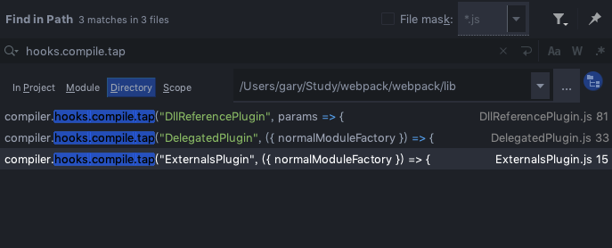

# Webpack源码-构建前

webpack的构建是以下面代码开始：
```js
const compiler = webpack(config);

compiler.run((err, stats) => {
    // ...
});
```
首先调用webpack方法：
```js
const webpack = (options, callback) => {
	new WebpackOptionsDefaulter().process(options);
    // 生成compiler;
	const compiler = new Compiler();
    // webpack一些默认选项
	compiler.options = new WebpackOptionsApply().process(options, compiler);
	new WebEnvironmentPlugin(
		options.inputFileSystem,
		options.outputFileSystem
	).apply(compiler);
	if (callback) {
		compiler.run(callback);
	}
	return compiler;
};
```
这个方法会返回一个compiler实例，在返回前，会先调用```new WebpackOptionsApply().process(options, compiler)```。
::: details 查看process方法
```js
	process(options, compiler) {
		let ExternalsPlugin;
		compiler.outputPath = options.output.path;
		compiler.recordsInputPath = options.recordsInputPath || options.recordsPath;
		compiler.recordsOutputPath =
			options.recordsOutputPath || options.recordsPath;
		compiler.name = options.name;
		// TODO webpack 5 refactor this to MultiCompiler.setDependencies() with a WeakMap
		// @ts-ignore TODO
		compiler.dependencies = options.dependencies;
		if (typeof options.target === "string") {
			let JsonpTemplatePlugin;
			let FetchCompileWasmTemplatePlugin;
			let ReadFileCompileWasmTemplatePlugin;
			let NodeSourcePlugin;
			let NodeTargetPlugin;
			let NodeTemplatePlugin;

			switch (options.target) {
				case "web":
					JsonpTemplatePlugin = require("./web/JsonpTemplatePlugin");
					FetchCompileWasmTemplatePlugin = require("./web/FetchCompileWasmTemplatePlugin");
					NodeSourcePlugin = require("./node/NodeSourcePlugin");
					new JsonpTemplatePlugin().apply(compiler);
					new FetchCompileWasmTemplatePlugin({
						mangleImports: options.optimization.mangleWasmImports
					}).apply(compiler);
					new FunctionModulePlugin().apply(compiler);
					new NodeSourcePlugin(options.node).apply(compiler);
					new LoaderTargetPlugin(options.target).apply(compiler);
					break;
				case "webworker": {
					let WebWorkerTemplatePlugin = require("./webworker/WebWorkerTemplatePlugin");
					FetchCompileWasmTemplatePlugin = require("./web/FetchCompileWasmTemplatePlugin");
					NodeSourcePlugin = require("./node/NodeSourcePlugin");
					new WebWorkerTemplatePlugin().apply(compiler);
					new FetchCompileWasmTemplatePlugin({
						mangleImports: options.optimization.mangleWasmImports
					}).apply(compiler);
					new FunctionModulePlugin().apply(compiler);
					new NodeSourcePlugin(options.node).apply(compiler);
					new LoaderTargetPlugin(options.target).apply(compiler);
					break;
				}
				case "node":
				case "async-node":
					NodeTemplatePlugin = require("./node/NodeTemplatePlugin");
					ReadFileCompileWasmTemplatePlugin = require("./node/ReadFileCompileWasmTemplatePlugin");
					NodeTargetPlugin = require("./node/NodeTargetPlugin");
					new NodeTemplatePlugin({
						asyncChunkLoading: options.target === "async-node"
					}).apply(compiler);
					new ReadFileCompileWasmTemplatePlugin({
						mangleImports: options.optimization.mangleWasmImports
					}).apply(compiler);
					new FunctionModulePlugin().apply(compiler);
					new NodeTargetPlugin().apply(compiler);
					new LoaderTargetPlugin("node").apply(compiler);
					break;
				case "node-webkit":
					JsonpTemplatePlugin = require("./web/JsonpTemplatePlugin");
					NodeTargetPlugin = require("./node/NodeTargetPlugin");
					ExternalsPlugin = require("./ExternalsPlugin");
					new JsonpTemplatePlugin().apply(compiler);
					new FunctionModulePlugin().apply(compiler);
					new NodeTargetPlugin().apply(compiler);
					new ExternalsPlugin("commonjs", "nw.gui").apply(compiler);
					new LoaderTargetPlugin(options.target).apply(compiler);
					break;
				case "electron-main":
					NodeTemplatePlugin = require("./node/NodeTemplatePlugin");
					NodeTargetPlugin = require("./node/NodeTargetPlugin");
					ExternalsPlugin = require("./ExternalsPlugin");
					new NodeTemplatePlugin({
						asyncChunkLoading: true
					}).apply(compiler);
					new FunctionModulePlugin().apply(compiler);
					new NodeTargetPlugin().apply(compiler);
					new ExternalsPlugin("commonjs", [
						"app",
						"auto-updater",
						"browser-window",
						"clipboard",
						"content-tracing",
						"crash-reporter",
						"dialog",
						"electron",
						"global-shortcut",
						"ipc",
						"ipc-main",
						"menu",
						"menu-item",
						"native-image",
						"original-fs",
						"power-monitor",
						"power-save-blocker",
						"protocol",
						"screen",
						"session",
						"shell",
						"tray",
						"web-contents"
					]).apply(compiler);
					new LoaderTargetPlugin(options.target).apply(compiler);
					break;
				case "electron-renderer":
				case "electron-preload":
					FetchCompileWasmTemplatePlugin = require("./web/FetchCompileWasmTemplatePlugin");
					NodeTargetPlugin = require("./node/NodeTargetPlugin");
					ExternalsPlugin = require("./ExternalsPlugin");
					if (options.target === "electron-renderer") {
						JsonpTemplatePlugin = require("./web/JsonpTemplatePlugin");
						new JsonpTemplatePlugin().apply(compiler);
					} else if (options.target === "electron-preload") {
						NodeTemplatePlugin = require("./node/NodeTemplatePlugin");
						new NodeTemplatePlugin({
							asyncChunkLoading: true
						}).apply(compiler);
					}
					new FetchCompileWasmTemplatePlugin({
						mangleImports: options.optimization.mangleWasmImports
					}).apply(compiler);
					new FunctionModulePlugin().apply(compiler);
					new NodeTargetPlugin().apply(compiler);
					new ExternalsPlugin("commonjs", [
						"clipboard",
						"crash-reporter",
						"desktop-capturer",
						"electron",
						"ipc",
						"ipc-renderer",
						"native-image",
						"original-fs",
						"remote",
						"screen",
						"shell",
						"web-frame"
					]).apply(compiler);
					new LoaderTargetPlugin(options.target).apply(compiler);
					break;
				default:
					throw new Error("Unsupported target '" + options.target + "'.");
			}
		}
		// @ts-ignore This is always true, which is good this way
		else if (options.target !== false) {
			options.target(compiler);
		} else {
			throw new Error("Unsupported target '" + options.target + "'.");
		}

		if (options.output.library || options.output.libraryTarget !== "var") {
			const LibraryTemplatePlugin = require("./LibraryTemplatePlugin");
			new LibraryTemplatePlugin(
				options.output.library,
				options.output.libraryTarget,
				options.output.umdNamedDefine,
				options.output.auxiliaryComment || "",
				options.output.libraryExport
			).apply(compiler);
		}
		if (options.externals) {
			ExternalsPlugin = require("./ExternalsPlugin");
			new ExternalsPlugin(
				options.output.libraryTarget,
				options.externals
			).apply(compiler);
		}

		let noSources;
		let legacy;
		let modern;
		let comment;
		if (
			options.devtool &&
			(options.devtool.includes("sourcemap") ||
				options.devtool.includes("source-map"))
		) {
			const hidden = options.devtool.includes("hidden");
			const inline = options.devtool.includes("inline");
			const evalWrapped = options.devtool.includes("eval");
			const cheap = options.devtool.includes("cheap");
			const moduleMaps = options.devtool.includes("module");
			noSources = options.devtool.includes("nosources");
			legacy = options.devtool.includes("@");
			modern = options.devtool.includes("#");
			comment =
				legacy && modern
					? "\n/*\n//@ source" +
					  "MappingURL=[url]\n//# source" +
					  "MappingURL=[url]\n*/"
					: legacy
					? "\n/*\n//@ source" + "MappingURL=[url]\n*/"
					: modern
					? "\n//# source" + "MappingURL=[url]"
					: null;
			const Plugin = evalWrapped
				? EvalSourceMapDevToolPlugin
				: SourceMapDevToolPlugin;
			new Plugin({
				filename: inline ? null : options.output.sourceMapFilename,
				moduleFilenameTemplate: options.output.devtoolModuleFilenameTemplate,
				fallbackModuleFilenameTemplate:
					options.output.devtoolFallbackModuleFilenameTemplate,
				append: hidden ? false : comment,
				module: moduleMaps ? true : cheap ? false : true,
				columns: cheap ? false : true,
				lineToLine: options.output.devtoolLineToLine,
				noSources: noSources,
				namespace: options.output.devtoolNamespace
			}).apply(compiler);
		} else if (options.devtool && options.devtool.includes("eval")) {
			legacy = options.devtool.includes("@");
			modern = options.devtool.includes("#");
			comment =
				legacy && modern
					? "\n//@ sourceURL=[url]\n//# sourceURL=[url]"
					: legacy
					? "\n//@ sourceURL=[url]"
					: modern
					? "\n//# sourceURL=[url]"
					: null;
			new EvalDevToolModulePlugin({
				sourceUrlComment: comment,
				moduleFilenameTemplate: options.output.devtoolModuleFilenameTemplate,
				namespace: options.output.devtoolNamespace
			}).apply(compiler);
		}

		new JavascriptModulesPlugin().apply(compiler);
		new JsonModulesPlugin().apply(compiler);
		new WebAssemblyModulesPlugin({
			mangleImports: options.optimization.mangleWasmImports
		}).apply(compiler);

		new EntryOptionPlugin().apply(compiler);
		compiler.hooks.entryOption.call(options.context, options.entry);

		new CompatibilityPlugin().apply(compiler);
		new HarmonyModulesPlugin(options.module).apply(compiler);
		if (options.amd !== false) {
			const AMDPlugin = require("./dependencies/AMDPlugin");
			const RequireJsStuffPlugin = require("./RequireJsStuffPlugin");
			new AMDPlugin(options.module, options.amd || {}).apply(compiler);
			new RequireJsStuffPlugin().apply(compiler);
		}
		new CommonJsPlugin(options.module).apply(compiler);
		new LoaderPlugin().apply(compiler);
		if (options.node !== false) {
			const NodeStuffPlugin = require("./NodeStuffPlugin");
			new NodeStuffPlugin(options.node).apply(compiler);
		}
		new CommonJsStuffPlugin().apply(compiler);
		new APIPlugin().apply(compiler);
		new ConstPlugin().apply(compiler);
		new UseStrictPlugin().apply(compiler);
		new RequireIncludePlugin().apply(compiler);
		new RequireEnsurePlugin().apply(compiler);
		new RequireContextPlugin(
			options.resolve.modules,
			options.resolve.extensions,
			options.resolve.mainFiles
		).apply(compiler);
		new ImportPlugin(options.module).apply(compiler);
		new SystemPlugin(options.module).apply(compiler);

		if (typeof options.mode !== "string") {
			const WarnNoModeSetPlugin = require("./WarnNoModeSetPlugin");
			new WarnNoModeSetPlugin().apply(compiler);
		}

		const EnsureChunkConditionsPlugin = require("./optimize/EnsureChunkConditionsPlugin");
		new EnsureChunkConditionsPlugin().apply(compiler);
		if (options.optimization.removeAvailableModules) {
			const RemoveParentModulesPlugin = require("./optimize/RemoveParentModulesPlugin");
			new RemoveParentModulesPlugin().apply(compiler);
		}
		if (options.optimization.removeEmptyChunks) {
			const RemoveEmptyChunksPlugin = require("./optimize/RemoveEmptyChunksPlugin");
			new RemoveEmptyChunksPlugin().apply(compiler);
		}
		if (options.optimization.mergeDuplicateChunks) {
			const MergeDuplicateChunksPlugin = require("./optimize/MergeDuplicateChunksPlugin");
			new MergeDuplicateChunksPlugin().apply(compiler);
		}
		if (options.optimization.flagIncludedChunks) {
			const FlagIncludedChunksPlugin = require("./optimize/FlagIncludedChunksPlugin");
			new FlagIncludedChunksPlugin().apply(compiler);
		}
		if (options.optimization.sideEffects) {
			const SideEffectsFlagPlugin = require("./optimize/SideEffectsFlagPlugin");
			new SideEffectsFlagPlugin().apply(compiler);
		}
		if (options.optimization.providedExports) {
			const FlagDependencyExportsPlugin = require("./FlagDependencyExportsPlugin");
			new FlagDependencyExportsPlugin().apply(compiler);
		}
		if (options.optimization.usedExports) {
			const FlagDependencyUsagePlugin = require("./FlagDependencyUsagePlugin");
			new FlagDependencyUsagePlugin().apply(compiler);
		}
		if (options.optimization.concatenateModules) {
			const ModuleConcatenationPlugin = require("./optimize/ModuleConcatenationPlugin");
			new ModuleConcatenationPlugin().apply(compiler);
		}
		if (options.optimization.splitChunks) {
			const SplitChunksPlugin = require("./optimize/SplitChunksPlugin");
			new SplitChunksPlugin(options.optimization.splitChunks).apply(compiler);
		}
		if (options.optimization.runtimeChunk) {
			const RuntimeChunkPlugin = require("./optimize/RuntimeChunkPlugin");
			new RuntimeChunkPlugin(options.optimization.runtimeChunk).apply(compiler);
		}
		if (options.optimization.noEmitOnErrors) {
			const NoEmitOnErrorsPlugin = require("./NoEmitOnErrorsPlugin");
			new NoEmitOnErrorsPlugin().apply(compiler);
		}
		if (options.optimization.checkWasmTypes) {
			const WasmFinalizeExportsPlugin = require("./wasm/WasmFinalizeExportsPlugin");
			new WasmFinalizeExportsPlugin().apply(compiler);
		}
		let moduleIds = options.optimization.moduleIds;
		if (moduleIds === undefined) {
			// TODO webpack 5 remove all these options
			if (options.optimization.occurrenceOrder) {
				moduleIds = "size";
			}
			if (options.optimization.namedModules) {
				moduleIds = "named";
			}
			if (options.optimization.hashedModuleIds) {
				moduleIds = "hashed";
			}
			if (moduleIds === undefined) {
				moduleIds = "natural";
			}
		}
		if (moduleIds) {
			const NamedModulesPlugin = require("./NamedModulesPlugin");
			const HashedModuleIdsPlugin = require("./HashedModuleIdsPlugin");
			const OccurrenceModuleOrderPlugin = require("./optimize/OccurrenceModuleOrderPlugin");
			switch (moduleIds) {
				case "natural":
					// TODO webpack 5: see hint in Compilation.sortModules
					break;
				case "named":
					new NamedModulesPlugin().apply(compiler);
					break;
				case "hashed":
					new HashedModuleIdsPlugin().apply(compiler);
					break;
				case "size":
					new OccurrenceModuleOrderPlugin({
						prioritiseInitial: true
					}).apply(compiler);
					break;
				case "total-size":
					new OccurrenceModuleOrderPlugin({
						prioritiseInitial: false
					}).apply(compiler);
					break;
				default:
					throw new Error(
						`webpack bug: moduleIds: ${moduleIds} is not implemented`
					);
			}
		}
		let chunkIds = options.optimization.chunkIds;
		if (chunkIds === undefined) {
			// TODO webpack 5 remove all these options
			if (options.optimization.occurrenceOrder) {
				// This looks weird but it's for backward-compat
				// This bug already existed before adding this feature
				chunkIds = "total-size";
			}
			if (options.optimization.namedChunks) {
				chunkIds = "named";
			}
			if (chunkIds === undefined) {
				chunkIds = "natural";
			}
		}
		if (chunkIds) {
			const NaturalChunkOrderPlugin = require("./optimize/NaturalChunkOrderPlugin");
			const NamedChunksPlugin = require("./NamedChunksPlugin");
			const OccurrenceChunkOrderPlugin = require("./optimize/OccurrenceChunkOrderPlugin");
			switch (chunkIds) {
				case "natural":
					new NaturalChunkOrderPlugin().apply(compiler);
					break;
				case "named":
					// TODO webapck 5: for backward-compat this need to have OccurrenceChunkOrderPlugin too
					// The NamedChunksPlugin doesn't give every chunk a name
					// This should be fixed, and the OccurrenceChunkOrderPlugin should be removed here.
					new OccurrenceChunkOrderPlugin({
						prioritiseInitial: false
					}).apply(compiler);
					new NamedChunksPlugin().apply(compiler);
					break;
				case "size":
					new OccurrenceChunkOrderPlugin({
						prioritiseInitial: true
					}).apply(compiler);
					break;
				case "total-size":
					new OccurrenceChunkOrderPlugin({
						prioritiseInitial: false
					}).apply(compiler);
					break;
				default:
					throw new Error(
						`webpack bug: chunkIds: ${chunkIds} is not implemented`
					);
			}
		}
		if (options.optimization.nodeEnv) {
			const DefinePlugin = require("./DefinePlugin");
			new DefinePlugin({
				"process.env.NODE_ENV": JSON.stringify(options.optimization.nodeEnv)
			}).apply(compiler);
		}
		if (options.optimization.minimize) {
			for (const minimizer of options.optimization.minimizer) {
				if (typeof minimizer === "function") {
					minimizer.call(compiler, compiler);
				} else {
					minimizer.apply(compiler);
				}
			}
		}

		if (options.performance) {
			const SizeLimitsPlugin = require("./performance/SizeLimitsPlugin");
			new SizeLimitsPlugin(options.performance).apply(compiler);
		}

		new TemplatedPathPlugin().apply(compiler);

		new RecordIdsPlugin({
			portableIds: options.optimization.portableRecords
		}).apply(compiler);

		new WarnCaseSensitiveModulesPlugin().apply(compiler);

		if (options.cache) {
			const CachePlugin = require("./CachePlugin");
			new CachePlugin(
				typeof options.cache === "object" ? options.cache : null
			).apply(compiler);
		}

		compiler.hooks.afterPlugins.call(compiler);
		if (!compiler.inputFileSystem) {
			throw new Error("No input filesystem provided");
		}
		compiler.resolverFactory.hooks.resolveOptions
			.for("normal")
			.tap("WebpackOptionsApply", resolveOptions => {
				return Object.assign(
					{
						fileSystem: compiler.inputFileSystem
					},
					cachedCleverMerge(options.resolve, resolveOptions)
				);
			});
		compiler.resolverFactory.hooks.resolveOptions
			.for("context")
			.tap("WebpackOptionsApply", resolveOptions => {
				return Object.assign(
					{
						fileSystem: compiler.inputFileSystem,
						resolveToContext: true
					},
					cachedCleverMerge(options.resolve, resolveOptions)
				);
			});
		compiler.resolverFactory.hooks.resolveOptions
			.for("loader")
			.tap("WebpackOptionsApply", resolveOptions => {
				return Object.assign(
					{
						fileSystem: compiler.inputFileSystem
					},
					cachedCleverMerge(options.resolveLoader, resolveOptions)
				);
			});
		compiler.hooks.afterResolvers.call(compiler);
		return options;
	}

```
:::
这个方法很长，主要作用是为webpack添加基础的配置和默认功能，接下来会经常看到它。


webpack 第一个触发的钩子是*compiler.hooks.beforeRun*, 全局查找注册了这个钩子的事件，发现在```NodeEnvironmentPlugin.js```中找到如下代码：
```js
		compiler.hooks.beforeRun.tap("NodeEnvironmentPlugin", compiler => {
			if (compiler.inputFileSystem === inputFileSystem) inputFileSystem.purge();
		});
```

这个方法主要是与fs模块环境相关的一些操作。

然后是*compiler.hooks.run*, 注册了这个钩子的是```CachePlugin.js```：
```js
			compiler.hooks.run.tapAsync("CachePlugin", (compiler, callback) => {
				if (!compiler._lastCompilationFileDependencies) {
					return callback();
				}
				const fs = compiler.inputFileSystem;
				const fileTs = (compiler.fileTimestamps = new Map());
				asyncLib.forEach(
					compiler._lastCompilationFileDependencies,
					(file, callback) => {
						fs.stat(file, (err, stat) => {
							if (err) {
								if (err.code === "ENOENT") return callback();
								return callback(err);
							}

							if (stat.mtime) this.applyMtime(+stat.mtime);

							fileTs.set(file, +stat.mtime || Infinity);

							callback();
						});
					},
					err => {
						if (err) return callback(err);

						for (const [file, ts] of fileTs) {
							fileTs.set(file, ts + this.FS_ACCURACY);
						}

						callback();
					}
				);
			});
```
主要是做缓存相关的事情，这里不深入讨论。

接下来调用```compiler.compile```方法：

```js
compile(callback) {
        // 生成normalModuleFactory和contextModuleFactory
		const params = this.newCompilationParams();

		this.hooks.beforeCompile.callAsync(params, err => {
			if (err) return callback(err);

			this.hooks.compile.call(params);

			const compilation = this.newCompilation(params);

			this.hooks.make.callAsync(compilation, err => {
				if (err) return callback(err);

				compilation.finish(err => {
					if (err) return callback(err);

					compilation.seal(err => {
						if (err) return callback(err);

						this.hooks.afterCompile.callAsync(compilation, err => {
							if (err) return callback(err);

							return callback(null, compilation);
						});
					});
				});
			});
		});
	}
```
首先，调用*newCompilationParams*方法生成*normalModuleFactory实例*和*contextModuleFactory实例*：
```js
	newCompilationParams() {
		const params = {
			normalModuleFactory: this.createNormalModuleFactory(),
			contextModuleFactory: this.createContextModuleFactory(),
			compilationDependencies: new Set()
		};
		return params;
	}
```

在创建*normalModuleFactory实例*时，会注册*normalModuleFactory.hooks.factory和normalModuleFactory.hooks.resolver*钩子，前者的作用是生成一个用于解析模块的*factory*,后者是生成一个解析器*resolver*。在以后调用*normalModuleFactory实例*的*create*方法时，会触发**normalModuleFactory.hooks.factory*钩子。

接着触发```compiler.hooks.beforeCompile```,这个钩子只有```DllReferencePlugin```注册了，与主流程无关，这里先不做讨论，这个钩子之后会触发```compiler.hooks.compile```,而它则在以下几个文件中出现：



这些也与主流程无关，不深入。

compiler.hooks.compile触发之后，会生成*compilation*对象，进入构建阶段
```js
const compilation = this.newCompilation(params);
    // ... 
newCompilation(params) {
	const compilation = this.createCompilation();
	compilation.fileTimestamps = this.fileTimestamps;
	compilation.contextTimestamps = this.contextTimestamps;
	compilation.name = this.name;
	compilation.records = this.records;
	compilation.compilationDependencies = params.compilationDependencies;
	this.hooks.thisCompilation.call(compilation, params);
	this.hooks.compilation.call(compilation, params);
	return compilation;
}
```
在创建compilation时, 会触发*compiler.hooks.thisCompilation*和*compiler.hooks.compilation*钩子，其中各种*EntryPlugin*（例如SingleEntryPlugin）会注册*compiler.hooks.compilation*钩子：
```js
		compiler.hooks.compilation.tap(
			"SingleEntryPlugin",
			(compilation, { normalModuleFactory }) => {
				compilation.dependencyFactories.set(
					SingleEntryDependency,
					normalModuleFactory
				);
			}
		);
```
作用是在compilation生成时，创建对应的*dependency*与*moduleFactory*作为键值对存放在*compilation.dependencyFactories*上。

接下来触发```compiler.hooks.make```,正式进入构建阶段。


