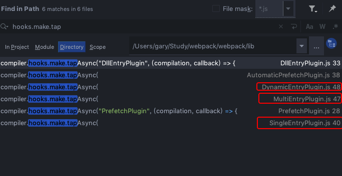

# Webpack源码-构建

## 找到入口

上文讲到，通过触发```compiler.hooks.make```钩子正式进入构建阶段，全局搜索注册了这个钩子的事件：



可以看到，主要是*EntryPlugin*注册了它,webpack会更具配置中的*entry*类型决定使用哪一个plugin,而这里的判断逻辑来自于上文中创建compiler前调用的```new WebpackOptionsApply().process(options, compiler)```中的 
```js
new EntryOptionPlugin().apply(compiler);
```

具体看看*EntryOptionPlugin().apply*:
```js
	apply(compiler) {
		compiler.hooks.entryOption.tap("EntryOptionPlugin", (context, entry) => {
			if (typeof entry === "string" || Array.isArray(entry)) {
				itemToPlugin(context, entry, "main").apply(compiler);
			} else if (typeof entry === "object") {
				for (const name of Object.keys(entry)) {
					itemToPlugin(context, entry[name], name).apply(compiler);
				}
			} else if (typeof entry === "function") {
				new DynamicEntryPlugin(context, entry).apply(compiler);
			}
			return true;
		});
	}
```

这里以对象形式的entry为例，遍历对象的每一项，最终每一项都调用*SingleEntryPlugin*

```js
// SingleEntryPlugin

	apply(compiler) {
		compiler.hooks.compilation.tap(
			"SingleEntryPlugin",
			(compilation, { normalModuleFactory }) => {
				compilation.dependencyFactories.set(
					SingleEntryDependency,
					normalModuleFactory
				);
			}
		);

		compiler.hooks.make.tapAsync(
			"SingleEntryPlugin",
			(compilation, callback) => {
				const { entry, name, context } = this;

				const dep = SingleEntryPlugin.createDependency(entry, name);
				compilation.addEntry(context, dep, name, callback);
			}
		);
	}
```
SingleEntryPlugin会注册*compiler.hooks.make*,所以```compiler.hooks.make```触发后，会继续接下来的流程：根据entry创建dependency，然后调用```compilation.addEntry(context, dep, name, callback);```

::: details 查看compilation.addEntry方法
```js
	addEntry(context, entry, name, callback) {
		this.hooks.addEntry.call(entry, name);

		const slot = {
			name: name,
			// TODO webpack 5 remove `request`
			request: null,
			module: null
		};

		if (entry instanceof ModuleDependency) {
			slot.request = entry.request;
		}

		// TODO webpack 5: merge modules instead when multiple entry modules are supported
		const idx = this._preparedEntrypoints.findIndex(slot => slot.name === name);
		if (idx >= 0) {
			// Overwrite existing entrypoint
			this._preparedEntrypoints[idx] = slot;
		} else {
			this._preparedEntrypoints.push(slot);
		}
		this._addModuleChain(
			context,
			entry,
			module => {
				this.entries.push(module);
			},
			(err, module) => {
				if (err) {
					this.hooks.failedEntry.call(entry, name, err);
					return callback(err);
				}

				if (module) {
					slot.module = module;
				} else {
					const idx = this._preparedEntrypoints.indexOf(slot);
					if (idx >= 0) {
						this._preparedEntrypoints.splice(idx, 1);
					}
				}
				this.hooks.succeedEntry.call(entry, name, module);
				return callback(null, module);
			}
		);
	}
```
:::

::: tip
可以看到在这个方法中会触发*compilation.hooks.addEntry*钩子，也就是说在编写插件的时候可以注册这个钩子，但是官方文档中并没有写这个钩子。类似的情况还有很多，例如normalModuleFactory.hooks.beforeResolve钩子，这些钩子都可以在编写插件时注册，但是官方文档里并没有列出。
:::

在*compilation.addEntry*方法中，会将entry缓存在*_preparedEntrypoints*数组上，接着调用*compilation._addModuleChain*方法。

::: details 查看compilation._addModuleChain方法
```js
	_addModuleChain(context, dependency, onModule, callback) {
		const start = this.profile && Date.now();
		const currentProfile = this.profile && {};

		const errorAndCallback = this.bail
			? err => {
					callback(err);
			  }
			: err => {
					err.dependencies = [dependency];
					this.errors.push(err);
					callback();
			  };

		if (
			typeof dependency !== "object" ||
			dependency === null ||
			!dependency.constructor
		) {
			throw new Error("Parameter 'dependency' must be a Dependency");
		}
		const Dep = /** @type {DepConstructor} */ (dependency.constructor);
		const moduleFactory = this.dependencyFactories.get(Dep);
		if (!moduleFactory) {
			throw new Error(
				`No dependency factory available for this dependency type: ${dependency.constructor.name}`
			);
		}

		this.semaphore.acquire(() => {
			moduleFactory.create(
				{
					contextInfo: {
						issuer: "",
						compiler: this.compiler.name
					},
					context: context,
					dependencies: [dependency]
				},
				(err, module) => {
					if (err) {
						this.semaphore.release();
						return errorAndCallback(new EntryModuleNotFoundError(err));
					}

					let afterFactory;

					if (currentProfile) {
						afterFactory = Date.now();
						currentProfile.factory = afterFactory - start;
					}

					const addModuleResult = this.addModule(module);
					module = addModuleResult.module;

					onModule(module);

					dependency.module = module;
					module.addReason(null, dependency);

					const afterBuild = () => {
						if (addModuleResult.dependencies) {
							this.processModuleDependencies(module, err => {
								if (err) return callback(err);
								callback(null, module);
							});
						} else {
							return callback(null, module);
						}
					};

					if (addModuleResult.issuer) {
						if (currentProfile) {
							module.profile = currentProfile;
						}
					}

					if (addModuleResult.build) {
						this.buildModule(module, false, null, null, err => {
							if (err) {
								this.semaphore.release();
								return errorAndCallback(err);
							}

							if (currentProfile) {
								const afterBuilding = Date.now();
								currentProfile.building = afterBuilding - afterFactory;
							}

							this.semaphore.release();
							afterBuild();
						});
					} else {
						this.semaphore.release();
						this.waitForBuildingFinished(module, afterBuild);
					}
				}
			);
		});
	}

```
:::

*compilation._addModuleChain*主要是通过上面由entry创建的*dependency*.constructor(这里是SingleEntryDependency)获取对应的*moduleFactory*(这里是NomalModuleFactory)，接着在*semaphore.acquire*中调用*moduleFactory.create*开始解析生成*wepback模块*。

这里有两个需要解释的点：
* emaphore.acquire是什么
* 如何解析生成模块

## emaphore.acquire是什么

在创建*compilation实例时*，会执行代码：
```js
this.semaphore = new Semaphore(options.parallelism || 100);

// Semaphore类
class Semaphore {
	/**
	 * Creates an instance of Semaphore.
	 *
	 * @param {number} available the amount available number of "tasks"
	 * in the Semaphore
	 */
	constructor(available) {
		this.available = available;
		/** @type {(function(): void)[]} */
		this.waiters = [];
		/** @private */
		this._continue = this._continue.bind(this);
	}

	/**
	 * @param {function(): void} callback function block to capture and run
	 * @returns {void}
	 */
	acquire(callback) {
		if (this.available > 0) {
			this.available--;
			callback();
		} else {
			this.waiters.push(callback);
		}
	}

	release() {
		this.available++;
		if (this.waiters.length > 0) {
			process.nextTick(this._continue);
		}
	}

	_continue() {
		if (this.available > 0) {
			if (this.waiters.length > 0) {
				this.available--;
				const callback = this.waiters.pop();
				callback();
			}
		}
	}
}

```
*Semaphore* 这个类是一个编译队列控制，原理很简单，对执行进行了并发控制，默认并发数为 100，超过后存入 semaphore.waiters，根据情况再调用 semaphore.release 去执行存入的事件 semaphore.waiters。

## 解析生成模块

从上一篇文章可以知道，调用*normalModuleFactory.create*触发*normalModuleFactory.hooks.factory*钩子生成*factory*,然后调用factory来生成模块。
::: details 查看normalModuleFactory.create方法
```js
// create 方法
	create(data, callback) {
		const dependencies = data.dependencies;
		const cacheEntry = dependencyCache.get(dependencies[0]);
		if (cacheEntry) return callback(null, cacheEntry);
		const context = data.context || this.context;
		const resolveOptions = data.resolveOptions || EMPTY_RESOLVE_OPTIONS;
		const request = dependencies[0].request;
		const contextInfo = data.contextInfo || {};
		this.hooks.beforeResolve.callAsync(
			{
				contextInfo,
				resolveOptions,
				context,
				request,
				dependencies
			},
			(err, result) => {
				if (err) return callback(err);

				// Ignored
				if (!result) return callback();

				const factory = this.hooks.factory.call(null);

				// Ignored
				if (!factory) return callback();

				factory(result, (err, module) => {
					if (err) return callback(err);

					if (module && this.cachePredicate(module)) {
						for (const d of dependencies) {
							dependencyCache.set(d, module);
						}
					}

					callback(null, module);
				});
			}
		);
	}
```
:::

会在*normalModuleFactory.beforeResolve*（NormalModuleReplacementPlugin注册的，不细说）触发后，触发factory开始解析生成模块：

::: details 查看normalModuleFactory.hooks.factory和normalModuleFactory.hooks.resolver代码：
```js
		this.hooks.factory.tap("NormalModuleFactory", () => (result, callback) => {
			let resolver = this.hooks.resolver.call(null);

			// Ignored
			if (!resolver) return callback();

			resolver(result, (err, data) => {
				if (err) return callback(err);

				// Ignored
				if (!data) return callback();

				// direct module
				if (typeof data.source === "function") return callback(null, data);

				this.hooks.afterResolve.callAsync(data, (err, result) => {
					if (err) return callback(err);

					// Ignored
					if (!result) return callback();

					let createdModule = this.hooks.createModule.call(result);
					if (!createdModule) {
						if (!result.request) {
							return callback(new Error("Empty dependency (no request)"));
						}

						createdModule = new NormalModule(result);
					}

					createdModule = this.hooks.module.call(createdModule, result);

					return callback(null, createdModule);
				});
			});
		});
		this.hooks.resolver.tap("NormalModuleFactory", () => (data, callback) => {
			const contextInfo = data.contextInfo;
			const context = data.context;
			const request = data.request;

			const loaderResolver = this.getResolver("loader");
			const normalResolver = this.getResolver("normal", data.resolveOptions);

			let matchResource = undefined;
			let requestWithoutMatchResource = request;
			const matchResourceMatch = MATCH_RESOURCE_REGEX.exec(request);
			if (matchResourceMatch) {
				matchResource = matchResourceMatch[1];
				if (/^\.\.?\//.test(matchResource)) {
					matchResource = path.join(context, matchResource);
				}
				requestWithoutMatchResource = request.substr(
					matchResourceMatch[0].length
				);
			}

			const noPreAutoLoaders = requestWithoutMatchResource.startsWith("-!");
			const noAutoLoaders =
				noPreAutoLoaders || requestWithoutMatchResource.startsWith("!");
			const noPrePostAutoLoaders = requestWithoutMatchResource.startsWith("!!");
			let elements = requestWithoutMatchResource
				.replace(/^-?!+/, "")
				.replace(/!!+/g, "!")
				.split("!");
			let resource = elements.pop();
			elements = elements.map(identToLoaderRequest);

			asyncLib.parallel(
				[
					callback =>
						this.resolveRequestArray(
							contextInfo,
							context,
							elements,
							loaderResolver,
							callback
						),
					callback => {
						if (resource === "" || resource[0] === "?") {
							return callback(null, {
								resource
							});
						}

						normalResolver.resolve(
							contextInfo,
							context,
							resource,
							{},
							(err, resource, resourceResolveData) => {
								if (err) return callback(err);
								callback(null, {
									resourceResolveData,
									resource
								});
							}
						);
					}
				],
				(err, results) => {
					if (err) return callback(err);
					let loaders = results[0];
					const resourceResolveData = results[1].resourceResolveData;
					resource = results[1].resource;

					// translate option idents
					try {
						for (const item of loaders) {
							if (typeof item.options === "string" && item.options[0] === "?") {
								const ident = item.options.substr(1);
								item.options = this.ruleSet.findOptionsByIdent(ident);
								item.ident = ident;
							}
						}
					} catch (e) {
						return callback(e);
					}

					if (resource === false) {
						// ignored
						return callback(
							null,
							new RawModule(
								"/* (ignored) */",
								`ignored ${context} ${request}`,
								`${request} (ignored)`
							)
						);
					}

					const userRequest =
						(matchResource !== undefined ? `${matchResource}!=!` : "") +
						loaders
							.map(loaderToIdent)
							.concat([resource])
							.join("!");

					let resourcePath =
						matchResource !== undefined ? matchResource : resource;
					let resourceQuery = "";
					const queryIndex = resourcePath.indexOf("?");
					if (queryIndex >= 0) {
						resourceQuery = resourcePath.substr(queryIndex);
						resourcePath = resourcePath.substr(0, queryIndex);
					}

					const result = this.ruleSet.exec({
						resource: resourcePath,
						realResource:
							matchResource !== undefined
								? resource.replace(/\?.*/, "")
								: resourcePath,
						resourceQuery,
						issuer: contextInfo.issuer,
						compiler: contextInfo.compiler
					});
					const settings = {};
					const useLoadersPost = [];
					const useLoaders = [];
					const useLoadersPre = [];
					for (const r of result) {
						if (r.type === "use") {
							if (r.enforce === "post" && !noPrePostAutoLoaders) {
								useLoadersPost.push(r.value);
							} else if (
								r.enforce === "pre" &&
								!noPreAutoLoaders &&
								!noPrePostAutoLoaders
							) {
								useLoadersPre.push(r.value);
							} else if (
								!r.enforce &&
								!noAutoLoaders &&
								!noPrePostAutoLoaders
							) {
								useLoaders.push(r.value);
							}
						} else if (
							typeof r.value === "object" &&
							r.value !== null &&
							typeof settings[r.type] === "object" &&
							settings[r.type] !== null
						) {
							settings[r.type] = cachedCleverMerge(settings[r.type], r.value);
						} else {
							settings[r.type] = r.value;
						}
					}
					asyncLib.parallel(
						[
							this.resolveRequestArray.bind(
								this,
								contextInfo,
								this.context,
								useLoadersPost,
								loaderResolver
							),
							this.resolveRequestArray.bind(
								this,
								contextInfo,
								this.context,
								useLoaders,
								loaderResolver
							),
							this.resolveRequestArray.bind(
								this,
								contextInfo,
								this.context,
								useLoadersPre,
								loaderResolver
							)
						],
						(err, results) => {
							if (err) return callback(err);
							if (matchResource === undefined) {
								loaders = results[0].concat(loaders, results[1], results[2]);
							} else {
								loaders = results[0].concat(results[1], loaders, results[2]);
							}
							process.nextTick(() => {
								const type = settings.type;
								const resolveOptions = settings.resolve;
								callback(null, {
									context: context,
									request: loaders
										.map(loaderToIdent)
										.concat([resource])
										.join("!"),
									dependencies: data.dependencies,
									userRequest,
									rawRequest: request,
									loaders,
									resource,
									matchResource,
									resourceResolveData,
									settings,
									type,
									parser: this.getParser(type, settings.parser),
									generator: this.getGenerator(type, settings.generator),
									resolveOptions
								});
							});
						}
					);
				}
			);
		});
```
:::

### resolver

#### enhanced-resolve

### module生成


