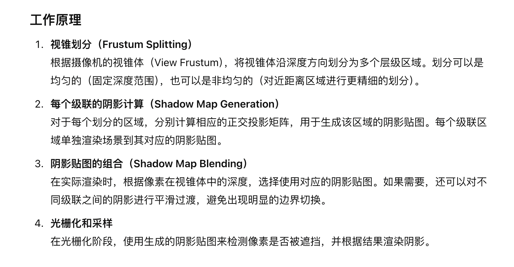
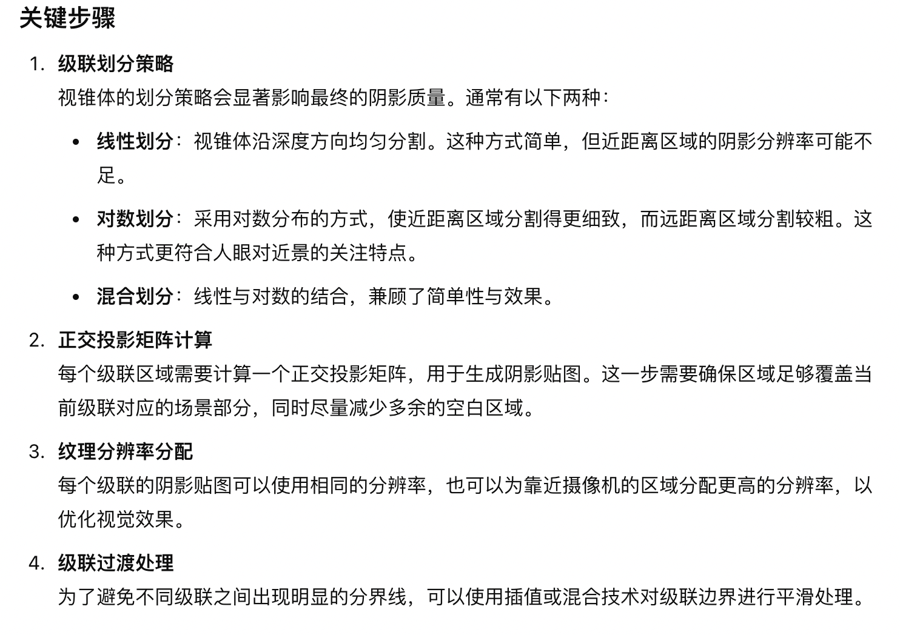
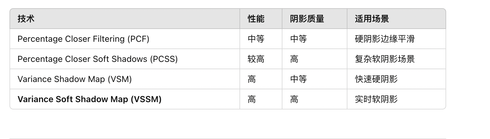
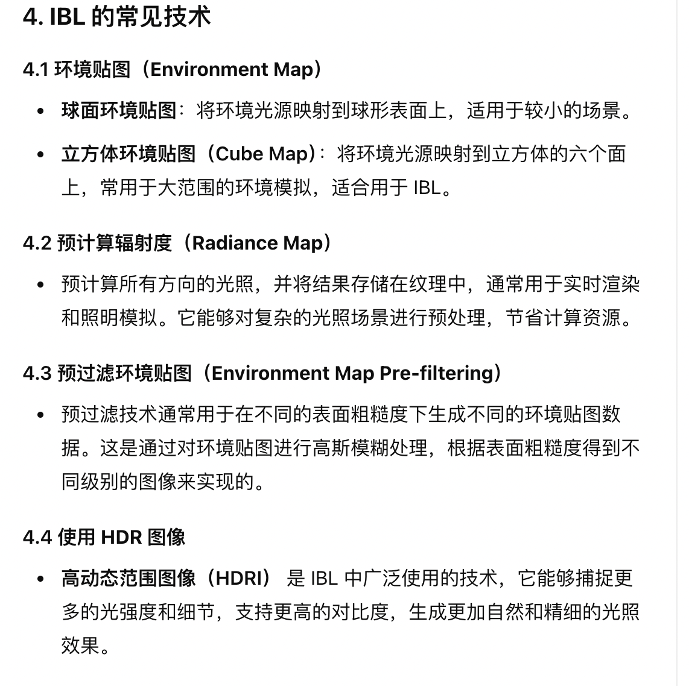

# 渲染

## 光
- 光的可见性

## 材质
在计算机图形学中，材质（Material）是用于定义物体表面如何与光交互的属性集合

材质决定了物体的外观特性，如颜色、光泽度、粗糙度、透明度和反射性等，模拟现实世界中不同材质的视觉效果。

### 材质模型
- Phong 模型
- Blinn-Phong 模型
- Lambert 模型
- Pbr 模型 
  - Specular Glossiness 模型
    - 漫反射颜色（Diffuse Color）
    - 镜面反射颜色（Specular Color）
    - 光泽度（Glossiness）
  - Metallic Roughness
    - 基础颜色（Base Color）
    - 金属度（Metallic）
    - 粗糙度（Roughness）
    - 环境光遮蔽（Ambient Occlusion, AO）
    - 发光（Emissive）

## 阴影
- 阴影贴图
  - 转换为光照空间，得到深度。
- 全局光照
  - 光照贴图

### Cascade Shadow（级联阴影）

### Variance Soft Shadow Map (VSSM)

- 是一种基于阴影贴图的改进技术，旨在高效实现软阴影效果。它通过对深度值的统计特性建模来计算阴影的模糊程度，相较于传统的阴影贴图（Shadow Map），VSSM 能够在保持实时性能的同时生成柔和的阴影边缘。
- 基本思想：Variance Soft Shadow Map 是基于 Variance Shadow Map (VSM) 的扩展版本。VSM 的核心思想是将场景深度值的平方和统计值存储在阴影贴图中，从而允许快速计算像素阴影的模糊程度。VSSM 在此基础上扩展了支持软阴影的能力，利用光源与遮挡物之间的距离关系动态调整阴影边缘的模糊程度。

## 光照

### Image-Based Lighting (IBL)
- 基本思想 ：IBL 的核心思想是用一张或多张图像代替物理上定义的光源，来模拟环境中的光照。具体来说，IBL 利用环境贴图、反射贴图、全景图等，结合 BRDF（双向反射分布函数），计算场景中物体的光照响应。

### Real-Time Global Illumination（实时全局光照）
实时全局光照 (Real-Time Global Illumination, RTGI) 是一种在动态场景中模拟光线间接反射、散射等复杂交互的技术，旨在提升渲染的真实感，同时满足实时渲染的性能需求。RTGI 是现代图形引擎（如 Unity、Unreal Engine）中实现逼真光照效果的重要部分。

## shader

### Uber Shader

