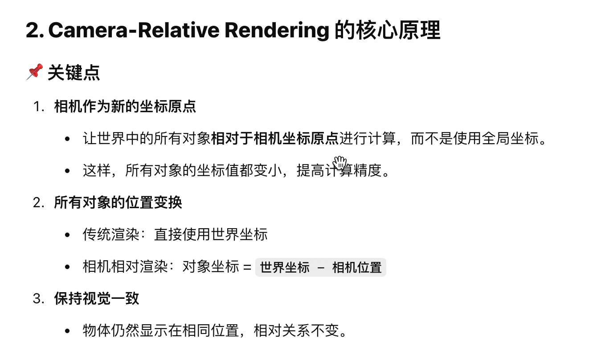

#

## LOD
LOD（Level of Detail，细节层级）是一种在计算机图形学中常用的优化技术，用于动态调整三维模型或场景渲染时的几何细节，以提高渲染性能和运行效率。根据对象与观察者（如摄像机）的距离，LOD 技术选择不同复杂度的模型或纹理，从而减少对计算资源的消耗。

## Subdivision & T-Junctions

## QuadTree-Based Subdivision（基于四叉树的细分）

## 浮点数精度溢出
- camera-relative rendering （相机相对渲染）
- 

## Tree Rendering

## Decorator Rendering

## Road and Decals Rendering

## Sky & Atmosphere

## Cloud

