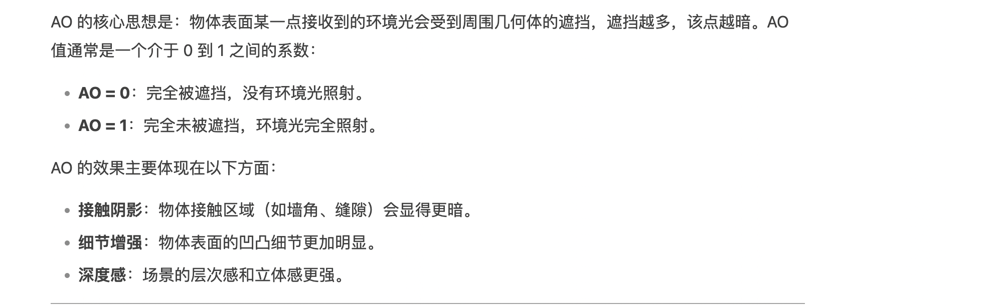
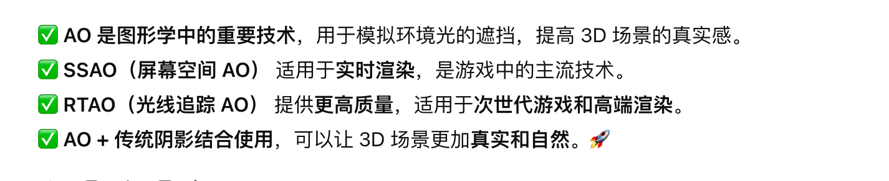
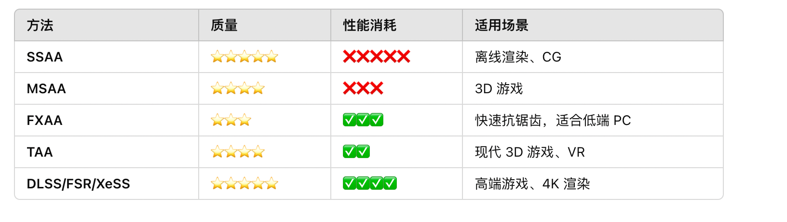
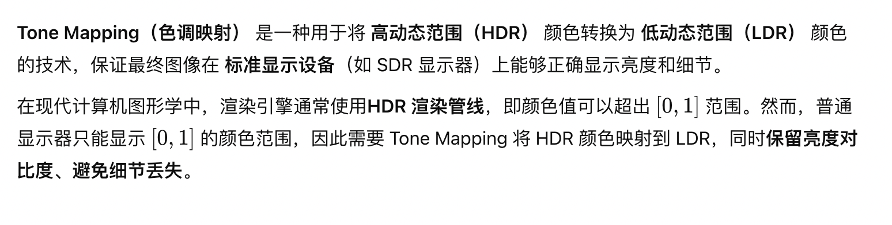

## Ambient Occlusion，环境光遮蔽

- 屏幕空间环境光遮蔽（SSAO，Screen Space Ambient Occlusion）
- 预计算 AO（Precomputed AO）
- 基于光线追踪的环境光遮蔽（RTAO, Ray-Traced AO）

## 反走样（Anti-Aliasing）

- 超采样反走样（SSAA, Super Sampling Anti-Aliasing）
- 多重采样反走样（MSAA, Multi-Sample Anti-Aliasing）
- 快速近似抗锯齿（FXAA, Fast Approximate Anti-Aliasing）
- 时间抗锯齿（TAA, Temporal Anti-Aliasing）
- 深度学习超级采样抗锯齿（DLSS / FSR / XeSS）

## 后处理（Post-process）
- Bloom（泛光）
  - 模拟高亮区域的光溢出
- Tone Mapping (色调映射)

- Color Grading

