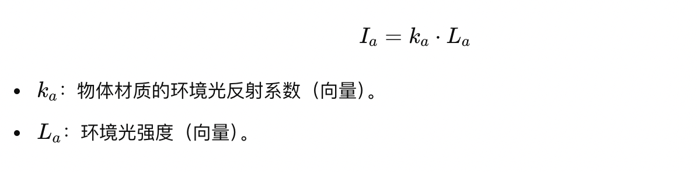
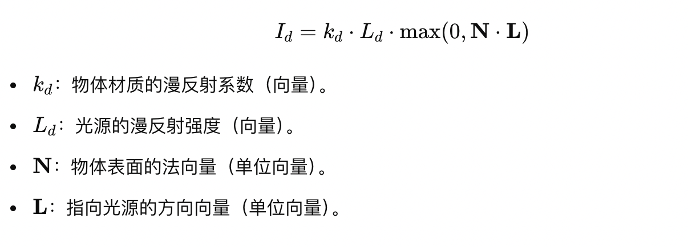
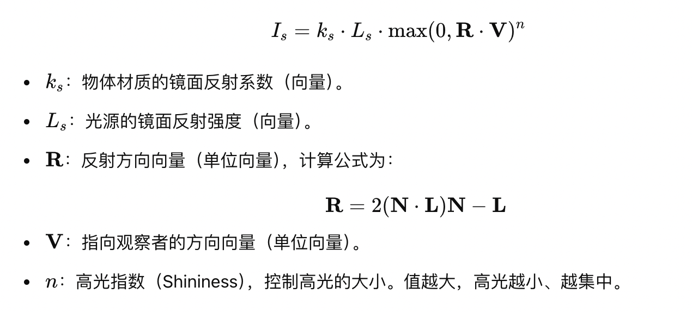
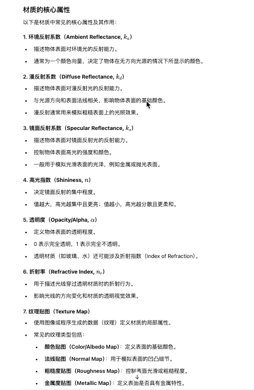
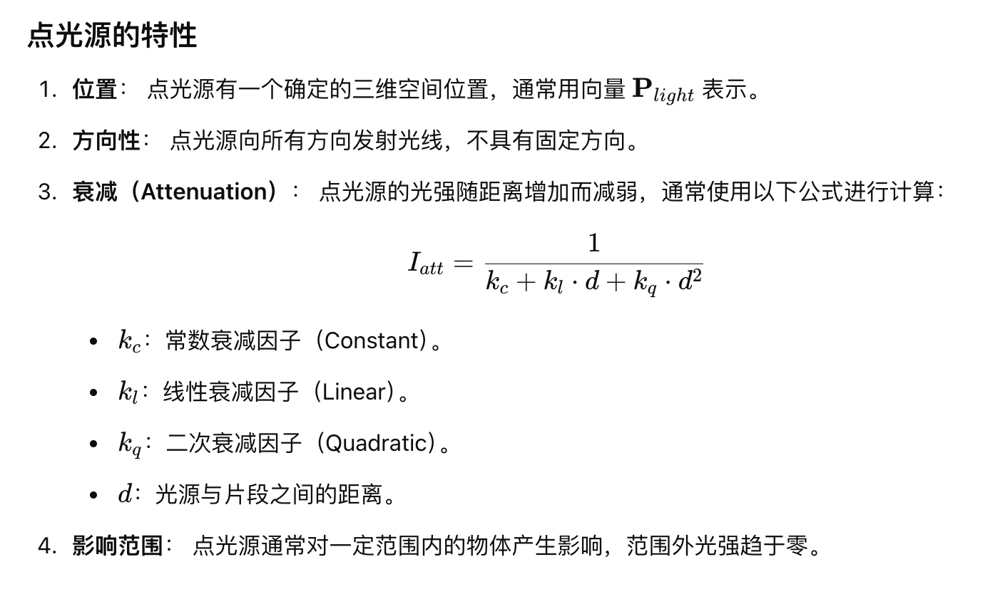
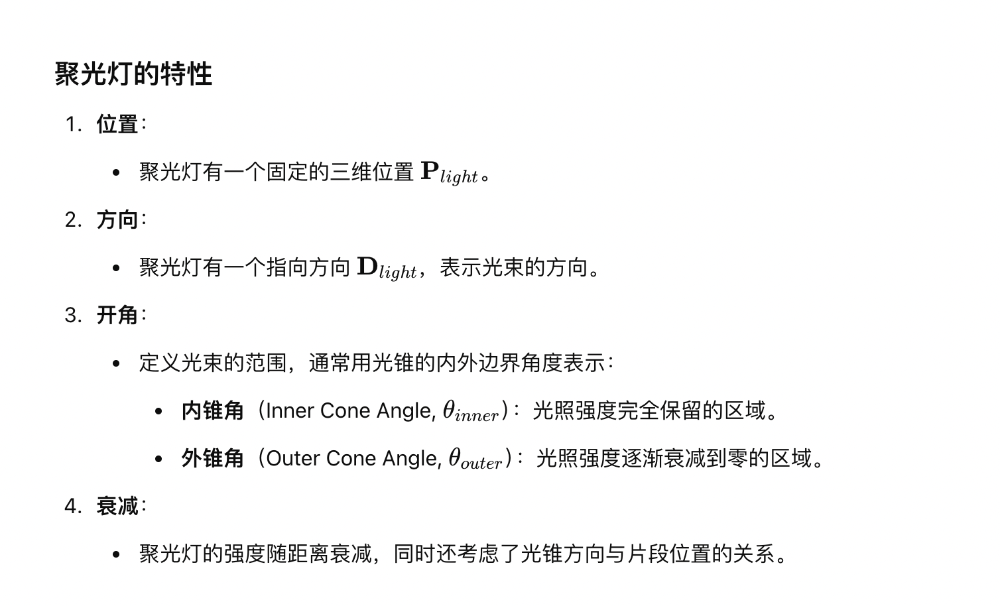
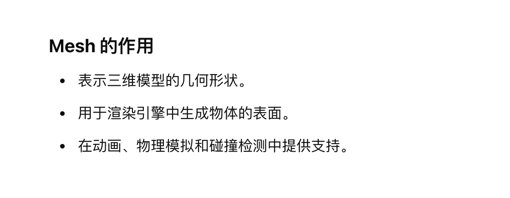
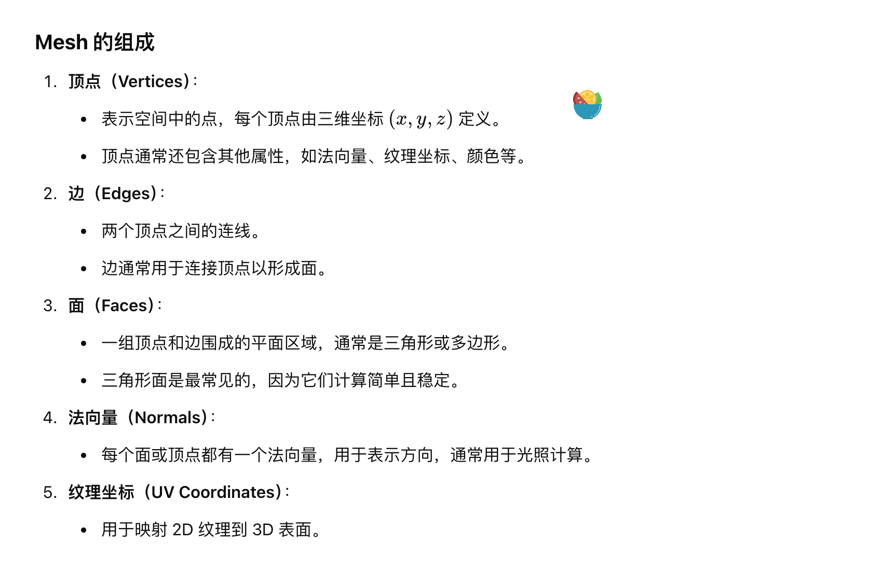
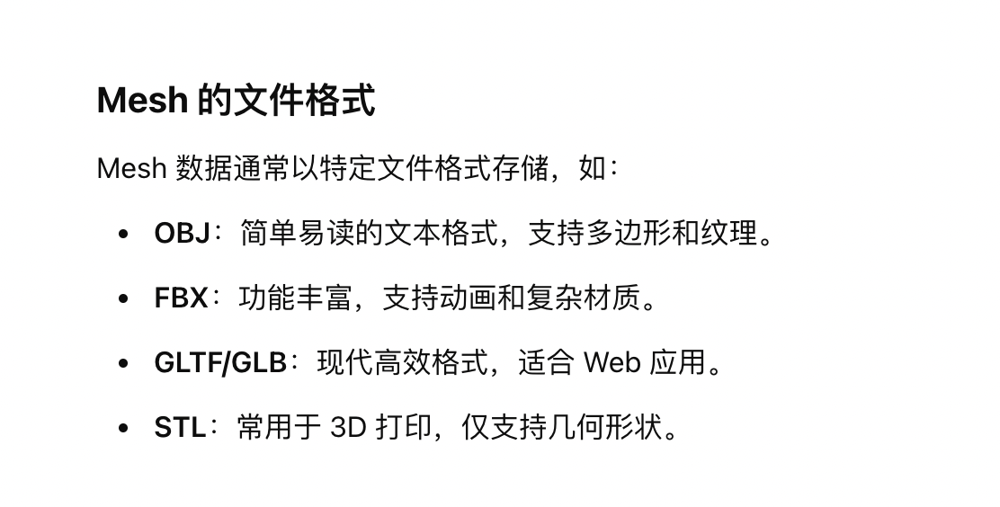
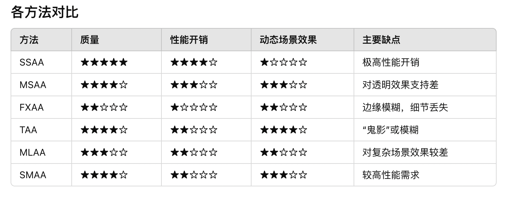

# LearnOpenGL学习笔记

## 图元

- GL_POINTS
- GL_TRIANGLES
- GL_LINE_STRIP

## 顶点着色器
- 顶点着色器主要的目的是把3D坐标转为另一种3D坐标，同时顶点着色器允许我们对顶点属性进行一些基本处理。

## 片段着色器
- 片段着色器的主要目的是计算一个像素的最终颜色
- 通常，片段着色器包含3D场景的数据（比如光照、阴影、光的颜色等等），这些数据可以被用来计算最终像素的颜色

## 图元装配
图元装配将顶点着色器（或几何着色器）输出的顶点作为输入，将所有的点装配成指定图元的形状

## 变量
- uniform：全局变量，所有顶点着色器都可以访问，且值在渲染过程中保持不变。

## 纹理
- GL_REPEAT 对纹理的默认行为。重复纹理图像。
- GL_MIRRORED_REPEAT 和GL_REPEAT一样，但每次重复图片是镜像放置的。
- GL_CLAMP_TO_EDGE 纹理坐标会被约束在0到1之间，超出的部分会重复纹理坐标的边缘，产生一种边缘被拉伸的效果。
- GL_CLAMP_TO_BORDER 超出的坐标为用户指定的边缘颜色

## 纹理过滤
- GL_NEAREST 采用最近邻插值法，即最近的像素颜色值，是OpenGL默认的纹理过滤方式
- GL_LINEAR 采用双线性插值法，即根据相邻的4个像素颜色值计算出中间值，可以使得图像更加平滑。

## 多级渐远纹理(Mipmap)
- GL_NEAREST_MIPMAP_NEAREST 使用最邻近的多级渐远纹理来匹配像素大小，并使用邻近插值进行纹理采样
- GL_LINEAR_MIPMAP_NEAREST 使用最邻近的多级渐远纹理级别，并使用线性插值进行采样
- GL_NEAREST_MIPMAP_LINEAR 在两个最匹配像素大小的多级渐远纹理之间进行线性插值，使用邻近插值进行采样
- GL_LINEAR_MIPMAP_LINEAR 在两个邻近的多级渐远纹理之间使用线性插值，并使用线性插值进行采样 

多级渐远纹理主要是使用在纹理被缩小的情况下的

## 坐标系统
- 局部空间
- 世界空间
- 观察空间
- 裁剪空间
- 屏幕空间

## 光照

### 冯氏光照模型
- 环境光照
环境光是场景中均匀分布的光照，不依赖于光源或物体表面方向，用于模拟间接光照。

- 漫反射光照
  漫反射光模拟了表面对光线的扩散反射，取决于光线方向与物体法线的夹角。


- 镜面光照
镜面反射光模拟了光线在光滑表面上的镜面反射，表现为高光区域。其强度取决于观察方向、光线反射方向和表面光滑度。


### 光的属性
- 光强度
- 颜色

### 材质

在计算机图形学中是指用于定义物体表面如何与光线交互的属性集合。材质的定义直接影响物体的视觉表现，包括颜色、光泽、透明度和纹理等特性。通过设置不同的材质参数，可以模拟各种现实中不同种类的表面，如金属、塑料、木材、布料等。


```glsl
void main()
{    
    // 环境光
    vec3 ambient = lightColor * material.ambient;

    // 漫反射 
    vec3 norm = normalize(Normal);
    vec3 lightDir = normalize(lightPos - FragPos);
    float diff = max(dot(norm, lightDir), 0.0);
    vec3 diffuse = lightColor * (diff * material.diffuse);

    // 镜面光
    vec3 viewDir = normalize(viewPos - FragPos);
    vec3 reflectDir = reflect(-lightDir, norm);  
    float spec = pow(max(dot(viewDir, reflectDir), 0.0), material.shininess);
    vec3 specular = lightColor * (spec * material.specular);  

    vec3 result = ambient + diffuse + specular;
    FragColor = vec4(result, 1.0);
}
```

### 光照贴图
在着色器中使用漫反射贴图的方法和纹理教程中是完全一样的

- 漫反射贴图（Diffuse Map）
- 镜面光贴图（Specular Map）

### 投光物
- 平行光
- 点光源：
  - 点光源的衰减：常数项，线性项，二次项


- 聚光灯：点光源加个罩子，手电筒
  - 平滑处理：我们需要模拟聚光有一个内圆锥(Inner Cone)和一个外圆锥(Outer Cone)。我们可以将内圆锥设置为上一部分中的那个圆锥，但我们也需要一个外圆锥，来让光从内圆锥逐渐减暗，直到外圆锥的边界。


#### 多光源的处理
在图形学中，当场景中有多个光源时，需要逐一计算每个光源对每个片段（Fragment）的贡献，并将这些贡献累加起来形成最终的光照效果。这种方法通常称为逐光源累加（Per-Light Accumulation）


## Mesh
Mesh 是三维计算机图形学中的一个基本概念，指的是网格结构，用于表示三维物体的几何形状。Mesh 是由顶点、边和面组成的网络，它们共同定义了一个物体的表面。





## 深度测试
用于确定像素在场景中的可见性

深度测试函数
- GL_LESS 像素的深度值小于深度缓冲区的深度值时，通过测试
- GL_LEQUAL 像素的深度值小于或等于深度缓冲区的深度值时，通过测试
- GL_GREATER 像素的深度值大于深度缓冲区的深度值时，通过测试
- GL_GEQUAL 像素的深度值大于或等于深度缓冲区的深度值时，通过测试
- GL_EQUAL 像素的深度值等于深度缓冲区的深度值时，通过测试
- GL_NOTEQUAL 像素的深度值不等于深度缓冲区的深度值时，通过测试
- GL_ALWAYS 总是通过测试
- GL_NEVER 总是不通过测试

### 深度冲突

原因： 
- 相邻表面非常接近，例如两个重叠的平面。
- 深度缓冲的精度不足。

解决： 
- 增加精度。
- 优化视锥体的近裁剪平面和远裁剪平面。
- 使用偏移量（Polygon Offset）


## 模板测试
模板测试用于判断像素是否在模板缓冲区中，在深度测试之前。
用于限制渲染区域。

轮廓

## 混合

glEnable(GL_BLEND);

## 面剔除

- 默认情况下，逆时针顶点所定义的三角形将会被处理为正向三角形

开启面剔除 glEnable(GL_CULL_FACE);

改变剔除类型：

glCullFace(type)：
- GL_FRONT 剔除正向面
- GL_BACK 剔除背向面
- GL_FRONT_AND_BACK 剔除正向和背向面

定义正向面：
glFrontFace(type):
- GL_CW 顺时针
- GL_CCW 逆时针

## 立方体贴图

## 抗锯齿（反走样）

- 超采样抗锯齿(Super Sample Anti-aliasing, SSAA)
  - 原理：将场景以更高分辨率渲染，然后缩小到目标分辨率。
- 多重采样抗锯齿（MSAA, Multisample Anti-Aliasing）
  - 原理：只对几何边缘上的像素进行多次采样，而不对整个像素着色。
- 快速近似抗锯齿（FXAA, Fast Approximate Anti-Aliasing）
  - 原理：在像素级别分析图像边缘，通过模糊边缘像素消除锯齿。
- 时间抗锯齿（TAA, Temporal Anti-Aliasing）
  - 原理：使用当前帧和前几帧的渲染结果，通过时间域上的信息融合来减少锯齿。
- 自适应抗锯齿（MLAA, Morphological Anti-Aliasing）
  - 检测图像中的边缘，并根据边缘方向模糊像素。
- 各向异性抗锯齿（SMAA, Subpixel Morphological Anti-Aliasing）
  - 结合几何信息（如 MSAA）和后处理边缘检测（如 FXAA）进行抗锯齿。
- 自适应分辨率抗锯齿
  - 动态调整渲染分辨率以减少锯齿和性能开销。


## 法线贴图


