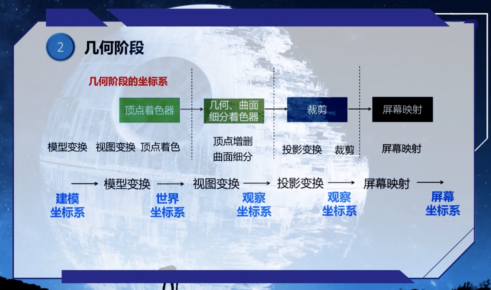
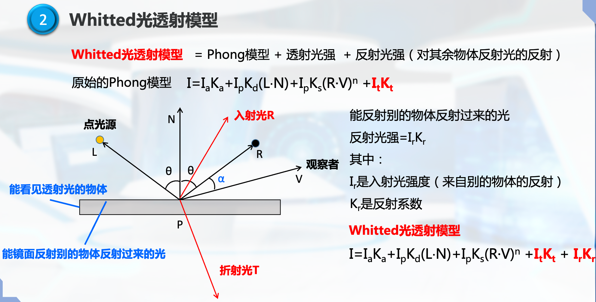

# 计算机图形学

## GPU 渲染管线

**功能**

- 决定在给定虚拟相机，三维物体，光源，照明模式，以及纹理等诸多条件的情况下生成或绘制一幅二维图像的过程。

**阶段**

- 应用阶段
- 几何阶段
- 光栅化阶段

## GPU 渲染管线工作过程

### 几何阶段

### 光栅化阶段

### GLSL 着色器编程

优点： **跨平台**

- 数据类型

  - 标量
  - 矢量
  - 矩阵
  - 结构和数组

- EBO,VBO,VAO
  - EBO（Element Buffer Object, 也叫 Index Buffer Object） 索引缓冲区对象： 存储顶点的索引信息
  - VBO（Vertex Buffer Object）顶点缓冲区对象：存储顶点的各种信息。好处：存储在 **GPU** 的显存里，提高读取效率
  - VAO（Vertex Array Object）顶点数组对象： 保存了所有顶点数据属性的状态集合，多个 VBO 的引用

## 造型技术

### 光栅化

- 也叫图形的扫描转化

- 软光栅
  使用算法而不借助 GPU 硬件实现光栅化

- 直线的扫描转化算法
  - 数值微分法（Digital Differential Analyzer， DDA）
    - 优点： DDA 算法直观，易实现
    - 缺点： 有浮点数和浮点运算，效率不高
  - 中点 Bresenham 算法
    - 优点： 避免了浮点数计算
- 圆的扫描转化算法
  - 八分法画圆
    - 绘制出 1/8 的圆弧，利用对称来画出其它 7 段
  - 中点 Bresenham 算法
- 多边形的扫描转化算法
  - X-扫描线算法
  - Y 向连贯性算法（有序边算法）
  - 边标志算法： 用于填充
- 多边形的填充

  - 种子填充算法

  ### 属性

  - 线型： 实线，虚线，点线， 线宽
  - 区域填充

  ### 反走样

  - 走样现象： 阶梯状（锯齿感），微小物体的忽略或闪烁
  - 反走样： 用于减少或消除走样效果的技术
    - 过取样（后滤波）
      - 过取样
      - 重叠过取样
    - 区域取样（前滤波）
      - 重叠面积大则亮一点，重叠面积小，则暗一点

## 造型技术

- 图形的构成：
  - 非图形信息
  - 图形信息
    - 几何信息
    - 拓扑信息

基本图形元素： 体， 面， 环， 边， 顶点

几何造型： 通过对点，线，面，体等集合元素，经平移，缩放，旋转等几何变换和并，交，差等几何运算，产生实际的或想象的物体模型

- 实体的性质

  - 刚性： 必须具有形状
  - 维度的一致性： 三维空间中，一个物体的各部分均应该是三维的
  - 占据有限的空间： 体积有限
  - 边界的确定性： 根据物体的边界能区分出物体的内部和外部
  - 封闭性： 经过一系列刚性物体及任意序列的集合运算之后，物体是有效的物体

- 实体的定义： 对于一个占据有限空间的正则形体，如果其表面是二维流形，则该正则形体是实体

- 规则形体
  - 边界表示
    - 多边形表面模型
    - 扫描表示
  - 构造实体几何表示（CSG）
  - 空间分割表示

## 光照模型

光照分类：
- 环境光
- 漫反射
- 镜面反射

光源分类:
- 平行光
- 点光源（光强随距离衰减）
- 聚光灯

### Phong模型

#### 环境光

#### 漫反射
光源来自一个方向，反射光均匀的射向各个方向，与视点无关。

#### 镜面反射

#### 综合

### Blin-Phong模型

### 全局光照

#### Whitted光透射模型

#### 光线追踪算法
##### 光线投射

##### 加上光线追踪

##### 主要思想

## 纹理
### 纹理映射

### 立方体贴图

### 几何纹理
#### 几何纹理算法
 
#### 法线贴图

##### Height Map (高度图)

### 阴影

#### 主流算法

##### Shadow Mapping

###### 问题： 阴影失真

## 消隐
消隐：决定场景中哪些物体的表面是可见的，哪些是遮挡的。
### 面剔除
#### 后向面判别

