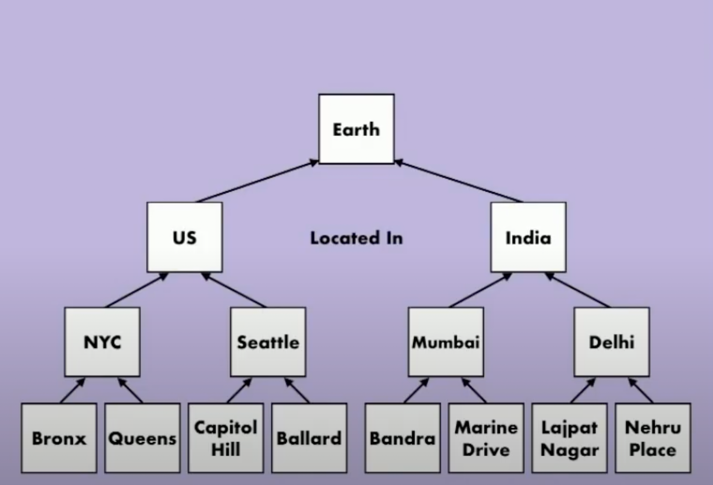
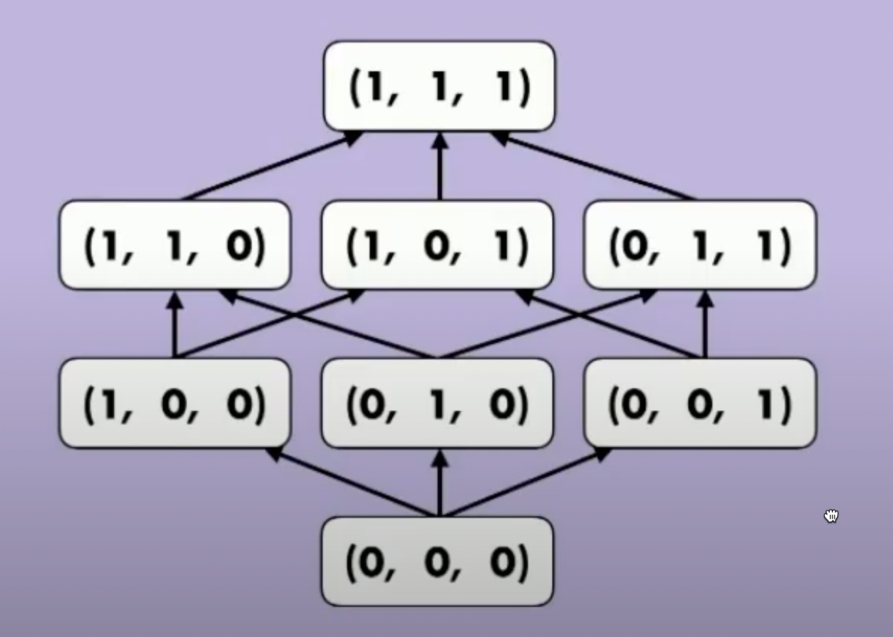
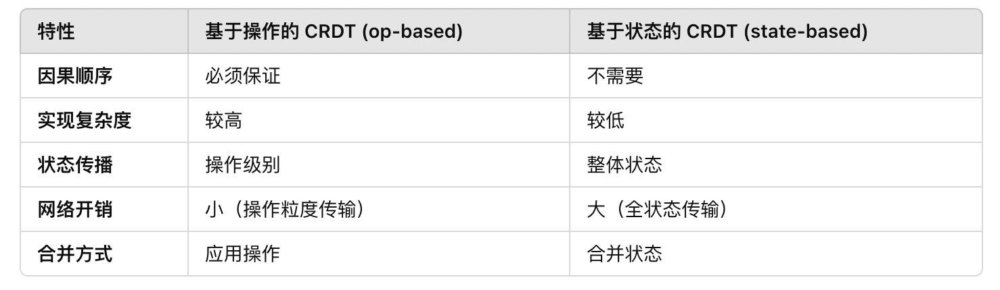

# CRDT

## CAP定理
CAP定理中的三个属性分别是： 
- 一致性 Consistency
- 可用性 Availability
- 分区容错 Partition Tolerance

CAP定理指出：一个分布式系统最多只能同时满足其中的两个属性，不可能同时满足三个。接下来，分别解释这三个属性。

### 一致性 Consistency
一致性指的是，系统中的所有节点在同一时刻看到的数据应该是相同的。换句话说，当一个操作（如写操作）完成后，所有的节点都应该立即得到相同的结果。

举例：假设一个系统中有多个数据库副本，用户向其中一个副本写入数据后，其他所有副本都应该立即反映这一更改。如果用户接下来读取数据，不管是从哪个副本读取，得到的结果应该是一样的。

### 可用性 Availability
可用性意味着系统的每次请求（无论是读请求还是写请求）都会收到一个响应，即使部分节点发生故障。换句话说，系统能够继续提供服务，即便有部分节点不可用或发生网络故障。

举例：即使某些服务器宕机或无法响应，系统仍然能够处理并返回请求，保持高可用性。

### 分区容错 Partition Tolerance
分区容错是指系统能够容忍网络分区的情况，即使网络中部分节点之间的通信被中断，系统仍然能够继续运作。分布式系统中的网络分区是指，网络连接由于某些原因（如网络故障）导致不同部分之间无法通信。

举例：在网络分区时，某些节点可能无法和其他节点通信。分区容忍性意味着系统即便在网络分区时，也能继续提供服务。

### CAP定理的实践

分布式系统的设计者通常需要根据应用场景进行权衡选择：

#### CP系统（一致性 + 分区容忍性）：

这种系统在网络分区时保证一致性，但会牺牲部分可用性。
典型例子：传统的关系型数据库，如 HBase 等，网络分区时会拒绝请求以保证数据一致性。

#### AP系统（可用性 + 分区容忍性）：

这种系统在网络分区时继续提供服务，但可能会导致不同节点间的数据不一致。
典型例子：如 DynamoDB、Cassandra，优先保持系统的高可用性。

#### CA系统（一致性 + 可用性）：

这种系统在网络不分区时可以同时保证一致性和可用性，但在分布式场景下无法实现分区容忍性。实际上，这种情况在真正的分布式系统中是不存在的，因为网络分区不可避免。

## CRDT的定义

- CRDT: 是可用的、分区容错的、并且具有强最终一致性。
- 强最终一致性：指的是，在一个分布式系统中，所有节点在任意时刻看到的数据总是相同的。

### 强一致性和最终一致性

- 强一致性：任何时刻对数据的读操作都将返回最新的写操作结果，无论数据的副本分布在何处，所有的读请求都能看到最新的写入。
  - 特点：
    - 同步：通常需要在所有副本上完成写操作后才能返回成功。
    - 延迟：写操作需要在所有副本上完成，因此延迟较高。
    - 适用场景：适用于对一致性要求极高的场景，比如银行转账、金融系统等
- 最终一致性：允许在短时间内出现不一致状态，但系统保证经过一段时间后，所有副本最终会达到一致
  - 特点：
    - 异步：写操作在所有副本上完成后立即返回成功，不保证所有副本都能达到一致。
    - 可用性：通常提供更高的可用性和更低的延迟，适合高并发的场景。
    - 适用场景：适用于社交网络、内容分发网络等对实时一致性要求不高的应用。

#### 比较
- 一致性保障：强一致性保证在任何时刻都能看到最新的数据，而最终一致性则允许在短时间内的数据不一致。
- 性能：强一致性往往带来更高的延迟和低可用性，而最终一致性在高负载时能够提供更好的响应速度和可用性。

### 最终一致性 - Eventual Consistency
最终一致性由三个属性构成
- 最终交付 Eventual Delivery: 发布到一个正确的副本上的更新列表最终将被传达至所有正确的副本
- 收敛 Convergence: 收到了一样的更新列表的正确副本们最终状态将一致
- 终止 Termination: 所有执行的方法都会终止（即保证算法能在有限时间内完成计算）

### 强最终一致性
确保所有副本在经历一定的网络延迟和操作后，能够在某个时刻达到一致状态。它结合了强一致性和最终一致性的特点。
- 所有更新都被立即可见。
- 冲突解决。
- 最终一致性保证

### 强最终一致性 - Strong Eventual Consistency (SEC)
强最终一致性定义为：满足「最终一致性 Eventual Consistency」且具有「强收敛性 Strong Convergence」。
- 强收敛 Strong Convergence: 收到了一样的更新列表的正确副本们的状态一致

「强最终一致性 SEC」和「最终一致性 EC」的区别在于 EC 有可能要求用户解决冲突，而 SEC 是不会发生冲突的。
[详情](https://stackoverflow.com/questions/29381442/eventual-consistency-vs-strong-eventual-consistency-vs-strong-consistency)

## CRDT的设计

### 偏序集 - Partial Order
设R是集合S上的一个二元关系，若R满足：

- 自反性：对任意x∈S，有xRx；

- 反对称性（即反对称关系）：对任意x,y∈S，若xRy，且yRx，则x=y；

- 传递性：对任意x, y,z∈S，若xRy，且yRz，则xRz。

则称R为S上的偏序关系，通常记作≼。注意这里的≼不必是指一般意义上的“小于或等于”。

若然有x≼y，我们也说x排在y前面。

### 格 - Lattice
- 如果一个偏序集的任意两个元素都有最小上界和最大下界，那么这一偏序集是一个格。

### 半格 - Semilatice
- 最小上界和最大下界只存在一个的偏序集称半格。

### join semilattice 联合半格
- 只存在最小上界的偏序集

### 单调联合半格
- 在联合半格的基础上增加了单调性：联合操作(取上确界操作)不会破坏元素的偏序关系。
即：如果在L中有a,b,c，且a≤b，则a∨c≤b∨c

如何产生：
- 状态构成一个联合半格，merge()操作是join操作(取上确界)；

定理：假设有 最终交付 和 终止 的属性，那么任意单调半格的 State-based 对象都是有强最终一致性的。

### 不可比较 - inComparable

US 和 India 不可比较

(S, ≤, s0, q, u, m)
### CRDT的类型
- 基于状态
  - 优点：
    - 实现简单，存储和传递整个状态
    - 无需因果关系保证
  - 缺点：
    - 同步开销较大
- 基于操作
  - 优点：
    - 高效的同步，只需传输操作，传输数据少
  - 缺点：
    - 对因果关系的依赖

### 基于状态的CRDT

需要：
- 按照某种顺序排序的状态类型<S, ≤>；
- 一个merge()  -> merge remote
- 一个update()  -> update local

### 基于操作的CRDT

- 充分条件:
  - 

### 实战

#### G-Counter (State Based)

#### PN-Counter (State Based)

#### LWW Set (Op Based)

