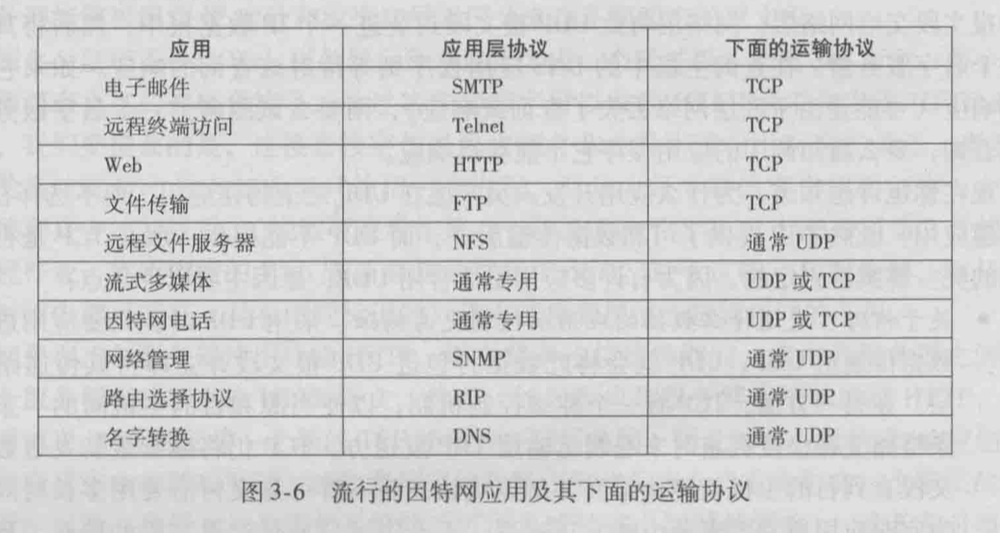

# 计算机网络

## 计算机网络概述

### 几个概念

- **套接字（socket）**： 应用程序和网络之间的编程接口。(理解为两个房子需要通信，而套接字就是房子的门)。
- **端口号**： 定义在目的主机中接收进程的标识符。
- **带宽敏感应用**： 具有吞吐量要求的应用程序。
- **弹性应用**： 能够很具情况利用可用使用的吞吐量的应用。
- **报文**：位于应用层的信息分组。
- **报文段**：位于运输层的分组。
- **数据报**： 位于网络层的分组。
- **帧**： 位于链路层的分组。
- **RTT**： 从客户端发送一个很小的数据包到服务器热然后服务器返回，总共的时间。

### 计算机网络分层

- 五层英特网协议栈： 应用层 -> 运输层 -> 网络层 -> 数据链路层 -> 物理层
- OSI七层模型： 应用层 -> 会话层 -> 表示层 -> 运输层 -> 网络层 -> 数据链路层 -> 物理层

OSI七层模型多出的两个层的作用：

- 会话层： 提供了数据交换定界和同步功能，包括了建立检查点和恢复方案的方法。
- 表示层： 使通信的应用程序能够解释交换数据的含义。

每一层，一个分组具有两种类型的字段： 首部字段和**有效载荷字段**。有效载荷字段通常是来自上一层的分组。

## 应用层

### 应用层协议

应用层协议定义了运行在不同端系统上的应用程序进程如何相互传递报文。

应用层协议定义了：

- 交换的报文类型。（例如请求报文和响应报文）
- 各种报文类型的语法。（报文中的各个字段，以及这些字段是如何描述的）
- 字段的语义。（字段包含信息的含义）
- 一个进程核实以及如何发送报文，对报文进行响应的规则

公开协议： 
- 由RFC（Request For Comments）定义
- 允许互操作

私有协议：
- 多数P2P文件共享应用

协议的内容：
- 消息的类型 
  - 请求消息
  - 响应消息
- 消息的语法
  - 消息有哪些字段
  - 每个字段如何描述
- 字段的语义
  - 字段中信息的含义
- 规则
  - 进程何时发送/响应消息
  - 进程如何发送/响应消息

网络应用对传输服务的需求：

- 数据丢失（可靠性）
- 时延
- 带宽

### 进程通信

进程之间通过**socket(套接字)**通信。
进程之间通过**端口号**寻址。

### TCP和UDP传输服务

TCP：
- 面向连接： 客户机/服务器进程需要先建立连接
- 可靠的传输
- 流量控制： 发送方不会发送速度过快，超过接收方的处理能力
- 拥塞控制： 当网络负载过重时，能够限制发送方的发送速度
- 不提供时间/延迟保障
- 不提供最小带宽保障

UDP：
- 无连接
- 不可靠传输
- 不提供：
  - 可靠性保障
  - 流量控制
  - 拥塞控制
  - 延迟保障
  - 带宽保障

### Web

寻址：
- URL
- Scheme: //host:port/path

### HTTP
**超文本传输协议**

版本： 
- 1.0：RFC 1945
- 1.1：RFC 2068

几个特点：
- 默认端口号80。
- HTTP的运输层协议是**TCP**。
- HTTP是无状态协议。不会保存请求的信息。
- HTTP可以使用持续连接和非持续连接。（即，每次请求响应后是否断开TCP连接）

持续连接和非持久性连接：
- 持续性连接：
  - 发送响应后，服务器保持TCP连接。
  - 后续的HTTP消息可以通过这个TCP发送。
- 非持续性连接：
  - 每个对象需要两个RTT。
  - 操作系统需要为每个TCP连接开销资源。

持续连接有两种：
- 无流水的持续连接：
  - 客户端在收到前一个响应后才会发送新的请求。
  - 每个请求对象需要1个RTT。
- 带流水机制的持续连接：
  - HTTP 1.1 的默认选项。
  - 只要遇到引用请求就会尽快发出请求。
  - 理想情况下，收到所有的引用对象只需耗时约一个RTT

HTTP报文格式：
请求报文： 第一行是**请求行**，之后的行是**首部行（请求头）**， 然后是空行， 接着是**实体主体（请求体）**
响应报文： 第一行是**状态行**，之后的行是**首部行（响应头）**， 然后是空行， 接着是**实体主体（响应体）**


### FTP
**文件传输协议**

特点： 运行在TCP上，使用连个并行的TCP链接，一个是**控制连接**，一个是**数据连接**。

**控制连接**是连续的，会贯穿真个过程，而**数据连接**是非连续的，在文件传输完成后会关闭该TCP连接，如果还有文件，则打开新的TCP连接。

### SMTP
**简单邮件传输协议**

运行在TCP上。

### DNS
**域名系统（Domain Name System）**

运行在UDP上。


## 运输层
运输层协议为运行在不同主机上的**应用进程**之间提供了**逻辑通信**。

运输层协议是在**端系统**中而不是在**路由器**中实现。

将主机间交付扩展到进程见得交付被称为**运输层的多路复用与多路分解**

常用应用对应的运输层协议：




### 多路复用与多路分解
- 将运输层报文段中的数据交付给正确的套接字的工作成为**多路分解**。
- 在原主机从不同套接字中收集数据块，并为每个数据块封装上首部信息从而生成报文段，然后将报文段传递到网络层，这个工作称为**多路复用**。

::: tip
传输层向上（socket）交付数据是**分解**，像下（网络层）交付数据是**复用**
:::

一个UDP套接字使用一个二元组标识，二元组由一个**目的IP地址**和一个**目的端口号**组成。两个不同发送方发送的UDP消息，当**目的IP地址**和**目的端口号**一样时（目的IP地址一定相同，即接收方IP地址），会被同一个UDP套接字接收。所以，多个客户端的发送消息可能被同一个socket接收。

一个TCP套接字使用一个四元组标识，包扩： **源IP地址**， **源端口号**， **目的IP地址**， **目的端口号**。不同的客户端发送的消息会被**不同的**socket接收。（一个客户端进程对应一个服务器socket）

### UDP
**用户数据报协议**

UDP只做了运输协议能够做的最少工作，除了**复用/分解**功能和少量的**差错检测**外，几乎没有对IP增加别的东西。

在使用UDP时，发送报文前， 发送方和接收方的运输层实体之间**没有握手**，所以UDP是**无连接的**。UDP报文段可能**丢失**和**非按续到达**

::: tip
UDP 上也可以实现可靠数据传输，但是需要应用层添加可靠性机制。
:::

适合使用UDP的场景：

- 没有拥塞控制（应用可更好的控制发送时间和速率） 。
- 无需连接建立（减少延迟）。
- 实现简单（无需维护连接状态）。
- 首部开销小。

UDP报文段结构：

```
[源端口号,  目的端口号]
[长度,         检验和]
[应用数据（报文）     ] 

```

UDP首部有4个字段，每个字段有两个字节组成。其中，**长度**字段是UDP报文的总字节数（首部+数据），**检验和**用于检查报文段是否出现差错。

::: tip
UDP 首部的目的端口号用于发送消息时找到对应的**UDP socket**。源端口号用于接收方响应消息。
:::

#### UDP检验和

UDP检验和提供了差错检测功能。**端到端原则**
目的： 检测UDP报文段在传输中是否发生错误。
步骤：
- 将报文段内容视为16bit整数。
- 计算所有整数的和，进位加载和的后面，将得到值求反。
- 将上一步得到的值放入首部检验和字段。

::: tip
检验和出错，则代表报文段出现错误，检验和没有出错，不代表报文段一定没有出错，只是没有检测出错误。
:::

### 可靠数据传输原理
什么是可靠？
- 不错（不会0变1）
- 不丢（不会丢失）
- 不乱（顺序不会乱）

信道的不可靠特性决定了可靠数据传输协议（rdt）的复杂性。


### TCP
**传输控制协议**


## 网络层
网络层协议为不同主机之间提供了**逻辑通信**。


## 数据链路层


## 物理层

## SSL
