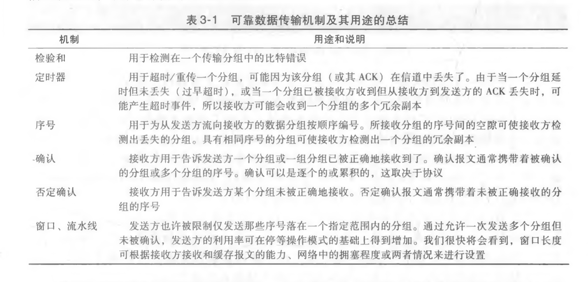
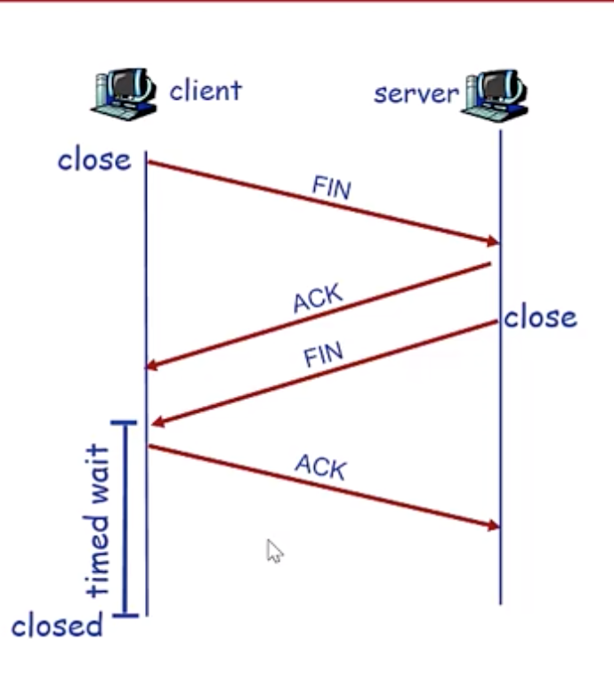
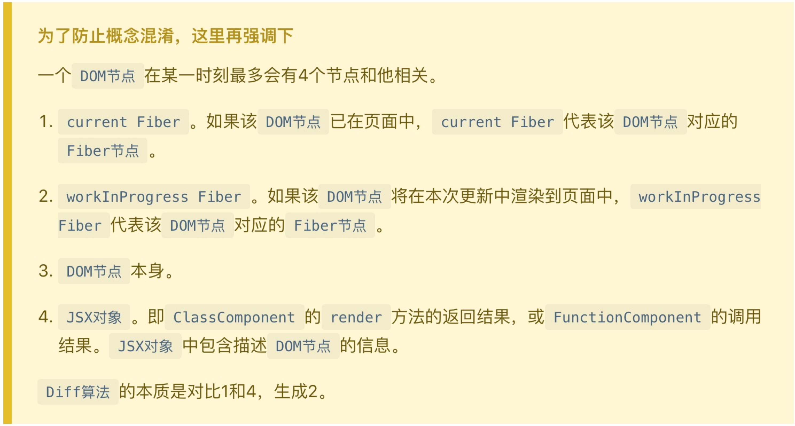
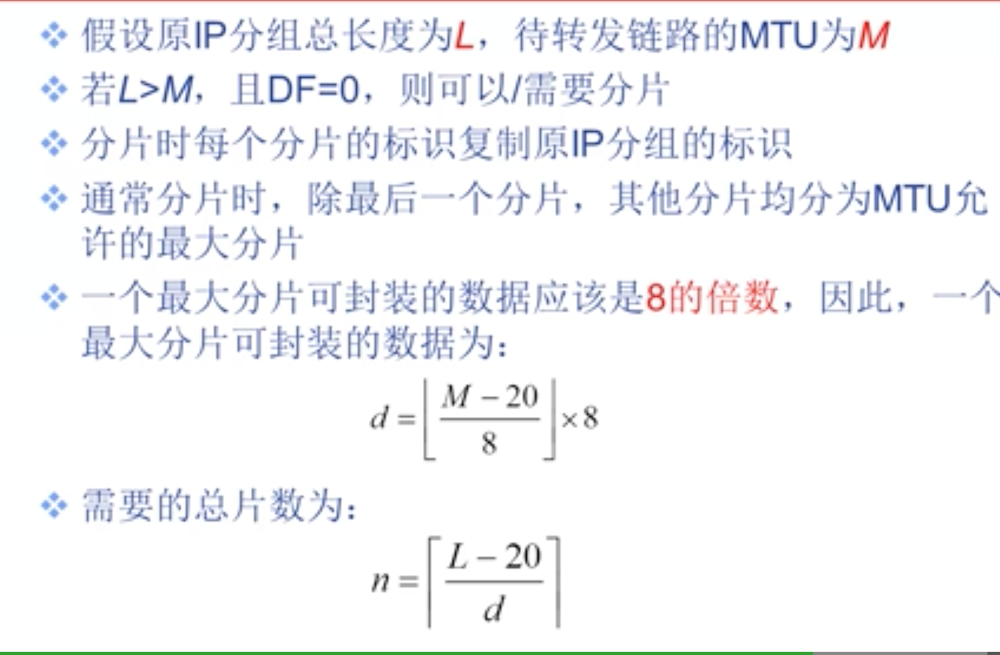
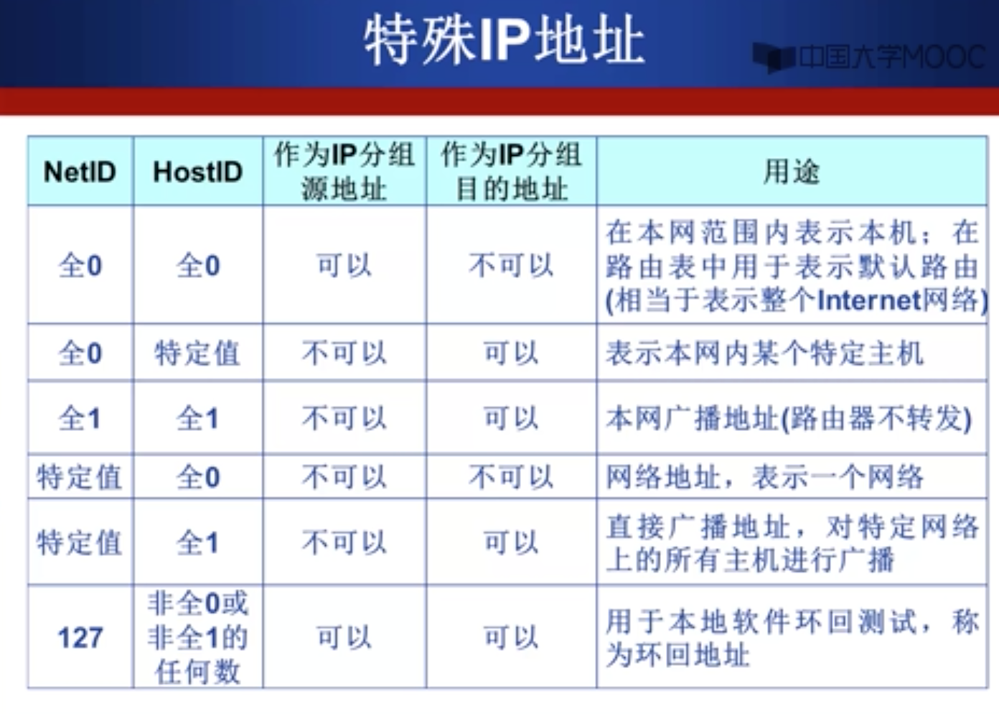
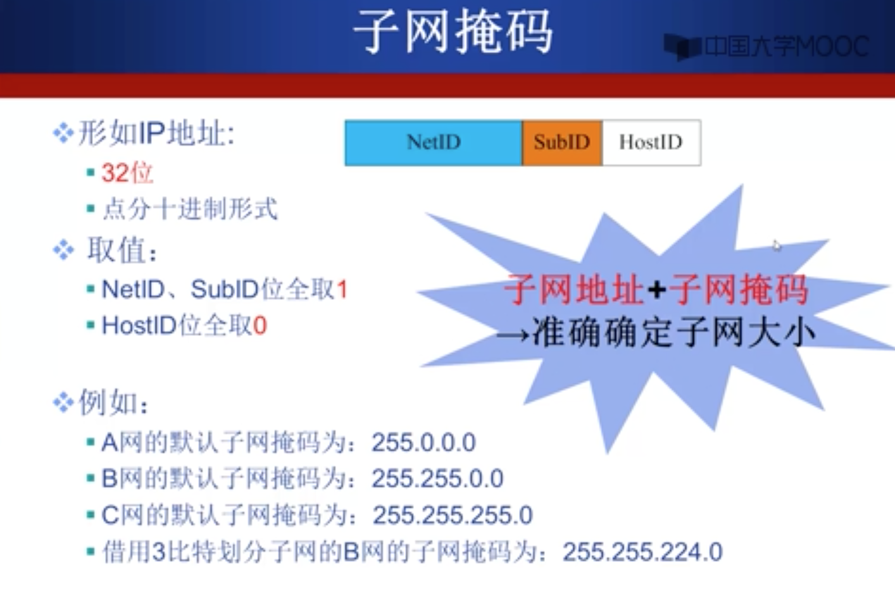
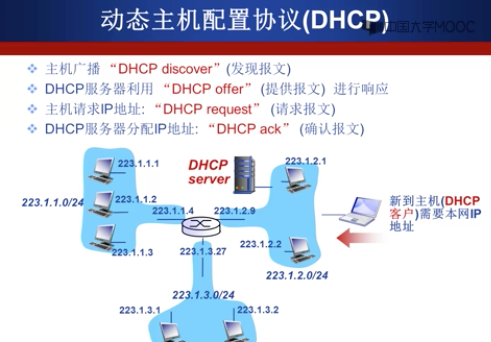
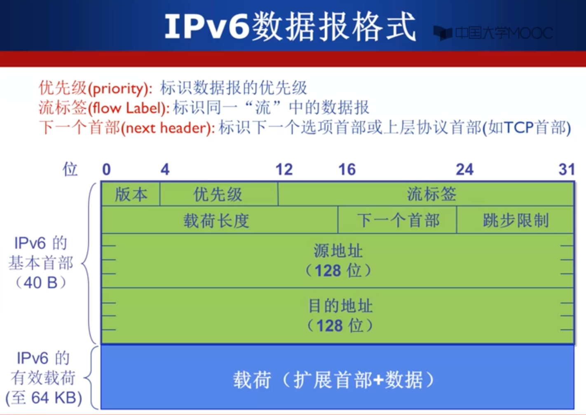

# 计算机网络

## 计算机网络概述

### 几个概念

- **套接字（socket）**： 应用程序和网络之间的编程接口。(理解为两个房子需要通信，而套接字就是房子的门)。
- **端口号**： 定义在目的主机中接收进程的标识符。
- **带宽敏感应用**： 具有吞吐量要求的应用程序。
- **弹性应用**： 能够很具情况利用可用使用的吞吐量的应用。
- **报文**：位于应用层的信息分组。
- **报文段**：位于运输层的分组。
- **数据报**： 位于网络层的分组。
- **帧**： 位于链路层的分组。
- **RTT**： 从客户端发送一个很小的数据包到服务器热然后服务器返回，总共的时间。

### 计算机网络分层

- 五层英特网协议栈： 应用层 -> 运输层 -> 网络层 -> 数据链路层 -> 物理层
- OSI 七层模型： 应用层 -> 会话层 -> 表示层 -> 运输层 -> 网络层 -> 数据链路层 -> 物理层

OSI 七层模型多出的两个层的作用：

- 会话层： 提供了数据交换定界和同步功能，包括了建立检查点和恢复方案的方法。
- 表示层： 使通信的应用程序能够解释交换数据的含义。

每一层，一个分组具有两种类型的字段： 首部字段和**有效载荷字段**。有效载荷字段通常是来自上一层的分组。

## 应用层

### 应用层协议

应用层协议定义了运行在不同端系统上的应用程序进程如何相互传递报文。

应用层协议定义了：

- 交换的报文类型。（例如请求报文和响应报文）
- 各种报文类型的语法。（报文中的各个字段，以及这些字段是如何描述的）
- 字段的语义。（字段包含信息的含义）
- 一个进程核实以及如何发送报文，对报文进行响应的规则

公开协议：

- 由 RFC（Request For Comments）定义
- 允许互操作

私有协议：

- 多数 P2P 文件共享应用

协议的内容：

- 消息的类型
  - 请求消息
  - 响应消息
- 消息的语法
  - 消息有哪些字段
  - 每个字段如何描述
- 字段的语义
  - 字段中信息的含义
- 规则
  - 进程何时发送/响应消息
  - 进程如何发送/响应消息

网络应用对传输服务的需求：

- 数据丢失（可靠性）
- 时延
- 带宽

### 进程通信

进程之间通过**socket(套接字)**通信。
进程之间通过**端口号**寻址。

### TCP 和 UDP 传输服务

TCP：

- 面向连接： 客户机/服务器进程需要先建立连接
- 可靠的传输
- 流量控制： 发送方不会发送速度过快，超过接收方的处理能力
- 拥塞控制： 当网络负载过重时，能够限制发送方的发送速度
- 不提供时间/延迟保障
- 不提供最小带宽保障

UDP：

- 无连接
- 不可靠传输
- 不提供：
  - 可靠性保障
  - 流量控制
  - 拥塞控制
  - 延迟保障
  - 带宽保障

### Web

寻址：

- URL
- Scheme: //host:port/path

### HTTP

**超文本传输协议**

版本：

- 1.0：RFC 1945
- 1.1：RFC 2068

几个特点：

- 默认端口号 80。
- HTTP 的运输层协议是**TCP**。
- HTTP 是无状态协议。不会保存请求的信息。
- HTTP 可以使用持续连接和非持续连接。（即，每次请求响应后是否断开 TCP 连接）

持续连接和非持久性连接：

- 持续性连接：
  - 发送响应后，服务器保持 TCP 连接。
  - 后续的 HTTP 消息可以通过这个 TCP 发送。
- 非持续性连接：
  - 每个对象需要两个 RTT。
  - 操作系统需要为每个 TCP 连接开销资源。

持续连接有两种：

- 无流水的持续连接：
  - 客户端在收到前一个响应后才会发送新的请求。
  - 每个请求对象需要 1 个 RTT。
- 带流水机制的持续连接：
  - HTTP 1.1 的默认选项。
  - 只要遇到引用请求就会尽快发出请求。
  - 理想情况下，收到所有的引用对象只需耗时约一个 RTT

HTTP 报文格式：
请求报文： 第一行是**请求行**，之后的行是**首部行（请求头）**， 然后是空行， 接着是**实体主体（请求体）**
响应报文： 第一行是**状态行**，之后的行是**首部行（响应头）**， 然后是空行， 接着是**实体主体（响应体）**

### FTP

**文件传输协议**

特点： 运行在 TCP 上，使用连个并行的 TCP 链接，一个是**控制连接**，一个是**数据连接**。

**控制连接**是连续的，会贯穿真个过程，而**数据连接**是非连续的，在文件传输完成后会关闭该 TCP 连接，如果还有文件，则打开新的 TCP 连接。

### SMTP

**简单邮件传输协议**

运行在 TCP 上。

### DNS

**域名系统（Domain Name System）**

运行在 UDP 上。

## 运输层

运输层协议为运行在不同主机上的**应用进程**之间提供了**逻辑通信**。

运输层协议是在**端系统**中而不是在**路由器**中实现。

将主机间交付扩展到进程见得交付被称为**运输层的多路复用与多路分解**

常用应用对应的运输层协议：


### 多路复用与多路分解

- 将运输层报文段中的数据交付给正确的套接字的工作成为**多路分解**。
- 在原主机从不同套接字中收集数据块，并为每个数据块封装上首部信息从而生成报文段，然后将报文段传递到网络层，这个工作称为**多路复用**。

::: tip
传输层向上（socket）交付数据是**分解**，像下（网络层）交付数据是**复用**
:::

一个 UDP 套接字使用一个二元组标识，二元组由一个**目的 IP 地址**和一个**目的端口号**组成。两个不同发送方发送的 UDP 消息，当**目的 IP 地址**和**目的端口号**一样时（目的 IP 地址一定相同，即接收方 IP 地址），会被同一个 UDP 套接字接收。所以，多个客户端的发送消息可能被同一个 socket 接收。

一个 TCP 套接字使用一个四元组标识，包扩： **源 IP 地址**， **源端口号**， **目的 IP 地址**， **目的端口号**。不同的客户端发送的消息会被**不同的**socket 接收。（一个客户端进程对应一个服务器 socket）

### UDP

**用户数据报协议**

UDP 只做了运输协议能够做的最少工作，除了**复用/分解**功能和少量的**差错检测**外，几乎没有对 IP 增加别的东西。

在使用 UDP 时，发送报文前， 发送方和接收方的运输层实体之间**没有握手**，所以 UDP 是**无连接的**。UDP 报文段可能**丢失**和**非按续到达**

::: tip
UDP 上也可以实现可靠数据传输，但是需要应用层添加可靠性机制（`确认` 和 `重传`）。
:::

适合使用 UDP 的场景：

- 没有拥塞控制（应用可更好的控制发送时间和速率） 。
- 无需连接建立（减少延迟）。
- 实现简单（无需维护连接状态）。
- 首部开销小。（UDP: 8 字节；TCP：20 字节）

UDP 报文段结构：

```
[源端口号,  目的端口号]
[长度,         检验和]
[应用数据（报文）     ]

```

UDP 首部有 4 个字段，每个字段有两个字节组成。其中，**长度**字段是 UDP 报文的总字节数（首部+数据），**检验和**用于检查报文段是否出现差错。

::: tip
UDP 首部的目的端口号用于发送消息时找到对应的**UDP socket**。源端口号用于接收方响应消息。
:::

#### UDP 检验和

UDP 检验和提供了差错检测功能。**端到端原则**
目的： 检测 UDP 报文段在传输中是否发生错误。
步骤：

- 将报文段内容视为 16bit 整数。
- 计算所有整数的和，进位加载和的后面，将得到值求反。
- 将上一步得到的值放入首部检验和字段。

::: tip
检验和出错，则代表报文段出现错误，检验和没有出错，不代表报文段一定没有出错，只是没有检测出错误。
:::

### 可靠数据传输原理

什么是可靠？

- 不错（不会 0 变 1）
- 不丢（不会丢失）
- 不乱（顺序不会乱）

信道的不可靠特性决定了可靠数据传输协议（rdt）的复杂性。

保证可靠传输的机制： **检验和**、**序号**、**定时器**、**肯定和否定确认**。

提高信道利用率的机制：**流水线机制**。

错误恢复：

- ACK: 接收方显式告知发送方分组已经正确接收
- NAK: 接收方显式告知发送方分组有错误
- 重传: 接收方接到 NAK 后，重传

**ARQ(Automatic Repeat reQuest)**: 基于上述重传机制的 rdt 协议。

**停等协议**: 发送方等待接收方返回的**ACK（肯定确认）**或**NAK（否定确认）**时，不会从上层获取更多的数据，直到 ACK 或 NAK 返回。

rdt 1.0: 完全可靠信道的可靠数据传输

rdt 2.0: 具有比特差错信道的可靠数据传输

- 差错检测。
- 接收方反馈（ACK 与 NAK）
- 重传： 接收方收到有差错的分组时，发送发重传该分组

rdt 2.1 对**发送方收到的接收方反馈（ACK 与 NAK）受损**时添加了处理办法：对发送数据分组进行**编号**,接收方会**丢弃重复分组**。

rdt 2.2 将**接收方反馈中的否定确认（NAK）移除**，使用带**分组序号**的 ACK，接收方如果收到**受损的分组**或**不对应序号的分组**，则会发送上个成功的分组的 ACK。发送方此时必须检查接收到的 ACK 报文中被确认的分组序号，如果是刚发送的分组，则发送成功，否则重传。

rdt 3.0: 具有比特差错的**丢包信道**的可靠数据传输

方法： 发送方等待“合理时间”

- 发送方
  - 如果超时后未收到对应序号的 ACK，直接**重传**，并**重启定时器**
  - 如果未超时，但是收到的是不对应序号的 ACK，**忽略**
-

#### 流水线机制

- 解决停等协议导致性能很差的问题， 显著提高网络资源的利用率。

**流水线可靠数据传输协议**：

- 允许发送方在收到 ACK 之前连续发送多个分组。需要：

  - 更大的序列号范围
  - 发送方和接收方需要更大的存储空间以**缓存分组**

- 流水线的差错恢复使用：
  - GBN
  - SR

#### 滑动窗口协议

#### GBN（Go-Back-N, 回退 N 步）协议：

- GBN 协议也被称为滑动窗口协议

N： 即窗口尺寸，也是允许的最大还未确认的分组数。

- 发送方：
  - 分组头部包含序列号
  - 窗口尺寸为 N，最多允许 N 个分组未确认
  - ACK(n): 确认到序列号 n 的分组均已被正确接收， `累计确认`。
  - Timeout(n): 重传序列号大于等于 n,还未收到 ACK 的所有分组
  - 响应的事件：
    - 上层的调用： 上层调用 rdt_send(),首先检查发送窗口是否已满，即是否有 N 个已发送但未被确认的分组
    - 收到一个 ACK: 累积确认
    - 超时事件： 发送方重传所有已发送但还未被确认过的分组
- 接收方：

  - **没有缓存** ：不会保存乱序到达的分组
  - 发送已被正确接收的**最高序列号的分组的 ACK**
  - 对于**乱序到达的分组直接丢弃**，再重新确认序列号最大的、按序到达的分组

**SR（Selective Repeat，选择重传）**:

- 接收方对每个分组单独确认，设置缓存机制，缓存乱序到达的分组
- 发送方只重传那些没收到 ACK 的分组，为每个分组设置定时器
- 相较于 GBN 只有发送方有窗口，SR 的接收方也有窗口
- N(Sender) + N(Receive) <= 2^k

**GBN 和 SR 的区别：**

- SR 接收方会缓存乱序到达的分组

**可靠数据传输机制及其用途的总结：**


### TCP

**传输控制协议**

特点：

- 面向连接的：发送数据前，需要先握手（连接状态只在连接的两端维护）
- 全双工服务
- 点对点: 单个发送方，单个接收方
- 可靠：接收方接收的字节流与发送方发送的字节流完全相同。

**TCP 报文段结构**：

```
---------------------- 32 bit ----------------------------
[源端口号，                                           目的端口号]
[                        序号                                 ]
[                       确认号                                ]
[首部长度，保留未使用，标志字段（GRG,ACK,PSH,RST,SYN, FIN）, 接收窗口]
[检验和，                                            紧急数据指针]
[                        选项                                 ]
[数据]
```

#### TCP 序列号和确认号

**序列号**：

- 指的是**字节流**的编号
- TCP 连接建立时，随机选择序列号

**确认号**：

- 希望收到的下一个字节的序列号(接收端**已经收到的有效连续**的报文段**加一**)，即，只会确认最后一个**连续的**报文段
- 累积确认：该序列号之前的所有字节都已被正确接收 （GBN 的特征）
- 由标志字段 ACK 指示确认号是否有效

#### 标志字段

**6bit 标志字段（即每个标志位只有一个 bit，只有 0 和 1）**

- ACK: 用来指示确认号是否有效。
- RST、SYN、FIN：用于 TCP 连接的建立和拆除。
- PSH: 指示接收方应立即将数据交给上层。
- URG: 用来指示报文段里存在着被发送端的上层实体置为“紧急”的数据。

::: tip
将定时器想象为与最早的未被确认的报文段相关联
:::

#### TCP 的可靠数据传输

- 流水线机制
- 发送方/接收方缓存：对于乱序到达的报文段，接收方会缓存，然后发送最后一个有序的连续报文段的确认 ACK(序号加一，因为 ACK 代表希望收到的下一个序列号)
- 累积确认：已经收到的最后一个有效连续的报文段
- 选择重传：重传超时的那一个报文段
- 单一定时器

#### RTT 和超时

**如何设置定时器的超时时间？**

如果时间过长：则对丢失时间反应慢，如果时间过短，则会造成不必要的重传。使用**指数加权移动平均** 的方式求得。

```
TimeoutInterval = EstimatedRTT = 4*DevRTT
```

#### TCP 发送方事件

- **从应用层收到数据**：
  - 创建 Segment（报文段）
  - 创建序列号（Segment 第一个字节的编号）
  - 开启定时器
  - 设置超时时间
- **超时**后：
  - 重传引起超时的 Segment
  - 重启定时器（`时间值翻倍`）
- **收到 ACK**后：
  - 如果是确认之前没收到确认的 Segment,则更新 SendBase,如果窗口中还有未被确认的分组，则重启定时器（因为 TCP 中只有一个定时器）

#### TCP 流量控制

原因：

- 接收方为 TCP 连接分配 buffer
- 上层可能处理 buffer 里数据的速度过慢

```
buffer中可用空间  = RcvWindow = RcvBuffer - [LastByteRcvd - LastByteRead]
```

处理：

- Receiver 通过在报文段首部将 RcvWindow（buffer 可用空间）告诉 Sender
- Sender 限制自己已经发送但是未收到 ACK 的数据不超过 RcvWindow

#### 连接管理

三次握手：

- 1， 发送方向接收方发送**SYN 报文段**（SYN 为 1）；
- 2， 接收方发送**SYNACK 报文段**（SYN 为 1）；
- 3， 发送方发送**ACK 报文段**（SYN 为 0，可携带数据）；


四次挥手：

- 1，发送方向接受方发送**FIN**；
- 2，接收方接收到**FIN**,向发送方发送**ACK**；
- 3，接收方向发送方发送**FIN**；
- 4，发送方收到**FIN**， 向接收方发送**ACK**



#### 拥塞控制

`拥塞控制的原理是感知网络拥塞和调整发送速率`

- 慢启动和拥塞避免
  - 慢启动： 发送速率在此阶段指数增长
  - 拥塞避免： 发送窗口（cwnd）改为之前值得一半，发送速率线性增长， 每次收到 ack，cwnd 增加 1
- 快速恢复
  收到三个冗余 ack 后 ssthredh(慢启动阈值)更新为 cwnd 的一半 （TCP Reno 版本）

## 网络层

网络层协议为不同主机之间提供了**逻辑通信**。

在网络中，每一台**主机**和**路由器**都有网络层部分。

**链路层交换机**：基于链路层桢中的字段做出转发决定。

**路由器**： 基于网络层数据报首部字段做出转发决定。

网络层的重要功能：

- 转发：将分组从路由器的输入端口转移到合适的输出端口（使用转发表）（单一路由器）
- 路由选择：确定分组从源到目的经过的路径（一个网络的所有路由器）
- 连接建立

网络层提供的特定服务：

- 确保交付： 确保分组最终能到的目的地
- 具有时延上界
- 有序分组交付： 确保分组以发送顺序到达目的地
- 确保最小带宽
- 确保最大时延抖动
- 安全性服务

英特网的网络层提供单一的服务：

- 尽力而为服务（看起来是**根本无服务**的一种委婉说法）

两个重要的 ATM 服务模型：

- 恒定比特率 ATM 网络服务（Constant Bit Rate, CBR）
- 可用比特率 ATM 网络服务（Available Bit Rate, ABR）

### 路由器工作原理

路由器的四个组件：

- 输入端口
- 输出端口
- 交换结构
- 路由选择处理器

转发表：确定路由器如何转发分组。

基于目的地转发： 路由器用分组目的地址的**前缀**与该表中的表项进行匹配，当有多个匹配时，该路由器使用最**长前缀匹配规则**

三种交换：通过内存交换，通过总线交换，通过互联网络交换

AMQ（主动队列管理）：在路由器缓存填满之前六七一个分组（或在其首部加上标记），以向发送方提供一个拥塞信号。

#### 分组调度

- 先进先出
- 优先权排队
- 循环排队规则
- 加权公平排队

### 虚电路和数据报网络

网络层也可以像运输层一样提供**连接**和**无连接服务**，但是与运输层不同的是：

- 网络层提供的是**主机**到**主机**的服务，而运输层提供的是**进程**到**进程**的服务
- 仅在网络层提供连接服务的计算机网络称为**虚电路网络**，仅在网络层提供无连接服务的计算机网络称为**数据报网络**
- 运输层的面向连接服务是由**端系统实现**，而网络层的连接服务除了在**端系统**中，也在**路由器**中实现

英特网是**数据报网络**；ATM、桢中继是**虚电路网络**。

#### 虚电路

**连接服务**

在虚电路网络中，连接被称为**虚电路**。

一条虚电路的组成如下：

- 1，源和目的主机之间的路径（即一系列链路和路由器）
- 2，VC 号，沿着该路径的每段链路的一个号码
- 3，沿着该路径的每台路由器中的转发表表项

虚电路的的三个阶段：

- 虚电路建立
- 数据传送
- 虚电路拆除

**信令报文**： 端系统向网络发送指示虚电路启动和终止的报文，以及路由器传递的用于建立虚电路的报文。

#### 数据报网络

特点：

- 网络层无连接
- 每个分组接携带目的地址
- 路由器根据分组的目的地之转发分组：
  - 基于路由协议/算法构建转发表
  - 检索转发表
  - 每个分组独立选路

在**数据报网络**中，每当一个端系统要发送分组，它就为该分组加上目的端系统的地址，然后将分组推进网络中。

路由器使用**最长前缀匹配规则**

对比：

数据报网络（Internet）:

- 计算机之间的数据交换：弹性服务，没有严格时间需求
- 链路类型众多：
  - 特点、性能各异。
  - 统一服务困难
- 智能端系统
  - 可以自适应、性能控制、差错恢复
- 简化网络，复杂“边缘”

VC 网络（虚电路网络，ATM）:

- 电话网络演化而来
- 核心业务是实时对话
  - 严格的时间、可靠性需求
  - 需要有保障的服务
- 非智能端系统
  - 电话机
  - 传真机
- 简化“边缘”，复杂网络

### 网际协议（IP）



- 首部固定长度 20 字节
- 首部长度字段（4bit）：标志着首部的长度， 其值以 4 个字节为单位
- 服务类型字段（8bit）：指示期望获得那种服务类型
- 总长度字段（16bit)： ip 分组的总**字节数**，即 IP 分组的最大字节数是：2^16 = 65535 字节
- 生存时间（8bit）: ip 分组在网络中可以通过的路由器数
- 协议字段（8bit）: ip 分组封装是是哪个协议的数据包（TCP | UDP）
- 首部校验和（16bit）: 实现 IP 分组首部的差错检测
- 源 IP 地址，目的 IP 地址（32bit）
- 选项字段（bit 可变）：携带安全，源选路径，时间戳和路由记录等内容
- 填充字段（bit 可变）：补齐整个首部，使得首部自己数是 4 的倍数
-

#### IP 分片与重组

- 大 IP 分组像较小的 MTU 链路转发时，可以被**分片**
- 一个 IP 分组可以分为多片 IP 分组
- IP 分片到达目的主机后进行**重组**

IP 首部的相关字段用于标识分片以及确定分片的相对顺序：

- 总长度
- 标识： IP 数据包的唯一标志
- 标志位（3bit）：分别是【保留，DF, MF】位。
- 片偏移（13bit）：1 个 IP 分组分片封装原 IP 分组数据的相对偏移量（以 8 字节为单位）


IP 分片过程：



**最大传送单元（MTU）**：

- 一个链路层帧能承载的最大数据量（可封装的数据域字节上限）。
- 不同链路的 MTU 不同

#### IPv4 编址

IP 分组：

- 源地址
- 目的地址

接口：主机、路由器与物理链路的连接

IPv4 地址：32bit 编号标识主机，路由器的接口。

- 网络号： 高位比特
- 主机号： 底比特位

IP 地址与每个接口关联。

IP 子网：

- IP 地址具有相同的网络号。
- 不跨越路由器。

IP 地址分类：

- 有类编址
  - A 类地址：8bi 网络号
  - B 类地址：16 位网络号
  - C 类地址：24 位网络号
  - D 类地址：1110 为网络号
  - E 类地址：1111 为网络号

特定 IP 地址及其用途：



子网划分：**子网掩码**

取值：网络号，子网号全 1，主机号取 0



子网掩码的应用：

将 IP 分组的 IP 地址与子网掩码**按位与**运算

#### CIDR

- 无类域间路由：不区分 A,B,C,D 类
- 融合子网地址和子网掩码： a.b.c.d/x x 是前缀长度

作用：

- 提高 IPv4 地址空间分配效率
- 提高路由效率：
  - 将多个子网聚合为一个较大的子网
  - 路由聚合

#### DHCP（动态主机配置协议）：

- 从服务器动态获取：
  - IP 地址
  - 子网掩码
  - 默认网关地址
  - DNS 服务器名称与 IP 地址
- 即插即用
- 允许地址重用
- 支持在用地址续租
- 支持移动用户加入网络

过程：



DHCP 协议在**应用层**实现：

- 请求报文封装在 UDP 数据报中
- IP 广播
- 链路层广播

#### NAT（网络地址转换）

动机：

- 一个私有网络只需要一个公共 IP 地址
- 本地网络设备 IP 地址变更，无需通告外界网络
- 变更 ISP 时，无需修改内部网络设备 IP
- 内部网络设备对外界不可见

实现：

- 替换：利用 NAT 的 IP 地址和端口号**替换**每个外出的 IP 数据报源 IP 地址，源端口号
- 记录：将每对 NAT 的 IP 地址和端口号与源 IP 地址与端口号的替换信息**记录**在**NAT 转换表**中
- 替换：根据**NAT 转换表**利用源 IP 地址和源端口号**替换**每个进入内网 IP 数据报的目的 IP 地址和端口号

主要争议：

- 路由器应该只处理第三层功能
- 违背端到端通信原则
  - 应用开发者必须考虑到 NAT 的存在 eg: p2p 应用

NAT 穿透问题：

- 解决方案 1： 静态配置 NAT，将特定端口的连接请求转发给服务器。
- 解决方案 2：利用 UPnP 互联网网关设备协议自动配置
  - 学习到 NAT 公共 IP 地址
  - 在 NAT 转换表中，增删转发表
- 解决方案 3： 中继
  - NAT 内部与中继服务器建立连接
  - 外部也与中继服务器激励连接
  - 中继服务器桥接两个链接

#### ICMP（因特网控制报文协议）

_ICMP 最典型的用途是差错报告_

作用：

- 差错（或异常）报告
- 网络探寻

两类 ICMP 报文：

- 差错报告报文（5 种）
  - 目的不可达
  - 源抑制
  - 超时
  - 参数问题（参数错误）
  - 重定向
- 网络探寻报文（2 组）
  - 回声请求与应答报文
  - 时间戳请求和应答报文


### IPv6

最初动机：32 位 IPv4 地址空间已经分配殆尽
其他动机：改进首部格式

- 快速处理/转发数据报
- 支持 QoS



IPv6 中还：

- 移除检验和
- 选项
- ICMPv6

IPv6 地址表示形式：

- 一般形式：16 进制冒号分割
- 压缩形式：双冒号表示 0
- URLs: 用中括号包起来

IPv4 像 IPv6 过度：

**隧道**： IPv6 数据报作为 IPv4 的载荷进行封装，穿越 IPv4 网络。

### 路由选择算法

根据全局式或分散式：

- 全局式路由选择算法
  - 也叫**链路状态算法**
- 分散式路由选择算法
  - **距离向量算法**

根据静态或动态：

- 静态路由选择算法
- 动态路由选择算法

根据负载敏感或负载迟钝划分：

- 负载敏感算法
- 负载迟钝算法

#### 链路状态路由选择算法

使用**链路状态广播**算法完成。

**Dijkastra 算法**：

## 数据链路层

## 物理层

## SSL

[计算机网络相关面试题](https://juejin.cn/post/6939691851746279437)
